# 🏗️ ARQUITECTURA Y RELACIONES DEL SISTEMA SPIRIT TOURS
## Mapa Completo de Componentes y Sus Interdependencias

**Versión:** 2.0 (Arquitectura Mejorada)  
**Fecha:** 16 de Octubre de 2024  
**Estado:** Migración de Monolito a Microservicios

---

## 🗺️ MAPA DE RELACIONES ACTUALES

```mermaid
graph TB
    subgraph "CAPA DE PRESENTACIÓN"
        WEB[React Web App]
        MOBILE[React Native Mobile]
        PORTAL[Provider Portal]
        ADMIN[Admin Dashboard]
    end
    
    subgraph "CAPA DE API"
        GATEWAY[API Gateway :8000]
        WS[WebSocket Server :8001]
    end
    
    subgraph "SERVICIOS DE NEGOCIO"
        QUOTE[Quotation Service]
        BOOK[Booking Service]
        GUIDE[Guide Service]
        HOTEL[Hotel Service]
        TRANS[Transport Service]
        ITIN[Itinerary Service]
    end
    
    subgraph "SERVICIOS DE SOPORTE"
        AUTH[Auth Service]
        EMAIL[Email Service]
        PAY[Payment Service]
        NOTIF[Notification Service]
        FILE[File Service]
    end
    
    subgraph "CAPA DE DATOS"
        DB[(PostgreSQL)]
        REDIS[(Redis Cache)]
        S3[S3 Storage]
        ELASTIC[ElasticSearch]
    end
    
    subgraph "INFRAESTRUCTURA"
        EVENT[Event Bus]
        QUEUE[Message Queue]
        WORKFLOW[Workflow Engine]
    end
    
    %% Conexiones Frontend
    WEB --> GATEWAY
    MOBILE --> GATEWAY
    PORTAL --> GATEWAY
    ADMIN --> GATEWAY
    WEB -.-> WS
    
    %% API Gateway Routes
    GATEWAY --> AUTH
    GATEWAY --> QUOTE
    GATEWAY --> BOOK
    GATEWAY --> GUIDE
    GATEWAY --> HOTEL
    GATEWAY --> TRANS
    GATEWAY --> ITIN
    
    %% Service Dependencies
    QUOTE --> HOTEL
    QUOTE --> TRANS
    QUOTE --> GUIDE
    QUOTE --> ITIN
    
    BOOK --> QUOTE
    BOOK --> PAY
    BOOK --> EMAIL
    BOOK --> NOTIF
    
    GUIDE --> NOTIF
    HOTEL --> NOTIF
    TRANS --> NOTIF
    
    %% Event Bus Communications
    QUOTE -.-> EVENT
    BOOK -.-> EVENT
    GUIDE -.-> EVENT
    HOTEL -.-> EVENT
    TRANS -.-> EVENT
    PAY -.-> EVENT
    
    EVENT -.-> WORKFLOW
    WORKFLOW -.-> QUEUE
    
    %% Data Layer
    QUOTE --> DB
    BOOK --> DB
    GUIDE --> DB
    HOTEL --> DB
    TRANS --> DB
    AUTH --> DB
    
    QUOTE --> REDIS
    BOOK --> REDIS
    AUTH --> REDIS
    
    FILE --> S3
    NOTIF --> ELASTIC
```



---

## 🔗 MATRIZ DE DEPENDENCIAS

### Servicios Principales y Sus Relaciones

| Servicio | Depende De | Es Usado Por | Eventos Emitidos | Eventos Consumidos |
|----------|------------|---------------|------------------|-------------------|
| **Quotation** | Hotel, Transport, Guide, Itinerary | Booking, Admin | QUOTATION_CREATED, QUOTATION_UPDATED | PRICE_UPDATED, AVAILABILITY_CHANGED |
| **Booking** | Quotation, Payment, Email | Admin, Reports | BOOKING_CONFIRMED, BOOKING_CANCELLED | PAYMENT_RECEIVED, QUOTATION_APPROVED |
| **Guide** | Notification, Calendar | Quotation, Booking | GUIDE_ASSIGNED, GUIDE_CONFIRMED | BOOKING_CREATED, TOUR_SCHEDULED |
| **Hotel** | Notification, Inventory | Quotation, Booking | HOTEL_CONFIRMED, ROOM_UPDATED | QUOTATION_REQUEST, BOOKING_REQUEST |
| **Transport** | Route, Vehicle | Quotation, Booking | TRANSPORT_CONFIRMED, ROUTE_OPTIMIZED | BOOKING_CREATED, ITINERARY_CHANGED |
| **Payment** | Gateway, Security | Booking, Refund | PAYMENT_COMPLETED, REFUND_PROCESSED | BOOKING_CONFIRMED, CANCELLATION_REQUEST |
| **Notification** | Email, SMS, Push | All Services | NOTIFICATION_SENT, DELIVERY_CONFIRMED | All Events |

---

## 🔄 FLUJOS DE DATOS CRÍTICOS

### 1. FLUJO DE COTIZACIÓN
```yaml
1. Cliente solicita cotización:
   Web App → API Gateway → Quotation Service

2. Quotation Service consulta disponibilidad:
   → Hotel Service (paralelo)
   → Transport Service (paralelo)  
   → Guide Service (paralelo)

3. Cálculo de costos:
   Quotation Service → Cost Calculator → Price Engine

4. Generación de propuesta:
   Quotation Service → PDF Generator → File Service → S3

5. Notificación al cliente:
   Quotation Service → Event Bus → Notification Service → Email/SMS

6. Tracking y seguimiento:
   Event Bus → Analytics Service → Dashboard
```

### 2. FLUJO DE RESERVA
```yaml
1. Cliente acepta cotización:
   Web App → API Gateway → Booking Service

2. Procesamiento de pago:
   Booking Service → Payment Service → Payment Gateway

3. Confirmación con proveedores:
   Event: BOOKING_CREATED →
   - Hotel Service → Confirmar habitaciones
   - Transport Service → Reservar vehículos
   - Guide Service → Asignar guías

4. Generación de documentos:
   Booking Service → Document Service → 
   - Vouchers
   - Itinerario detallado
   - Facturas

5. Comunicación final:
   Notification Service →
   - Email confirmación a cliente
   - SMS a guías asignados
   - Portal update para hoteles
```

### 3. FLUJO DE GESTIÓN DE CAMBIOS
```yaml
1. Solicitud de cambio:
   Cliente/Hotel → Portal → Change Request Service

2. Validación de impacto:
   Change Service →
   - Check disponibilidad alternativa
   - Recalcular costos
   - Evaluar penalizaciones

3. Aprobación workflow:
   Si monto < $500: Auto-aprobación
   Si monto > $500: Requiere admin

4. Ejecución del cambio:
   - Update reservas afectadas
   - Notificar a todos los involucrados
   - Ajustar documentación

5. Reconciliación:
   - Ajuste de pagos
   - Update de comisiones
   - Registro en audit log
```

---

## 🚀 MEJORAS IMPLEMENTADAS

### ANTES: Arquitectura Monolítica
```python
# Problemas identificados:
1. ACOPLAMIENTO FUERTE
   - Un cambio afecta todo el sistema
   - Imposible escalar componentes individuales
   - Testing complejo

2. SINGLE POINT OF FAILURE
   - Si falla el backend, falla todo
   - No hay redundancia
   - Recovery time largo

3. COMUNICACIÓN SÍNCRONA
   - Requests bloqueantes
   - Timeouts cascada
   - Performance degradation
```

### AHORA: Arquitectura de Microservicios
```python
# Soluciones implementadas:
1. SERVICIOS DESACOPLADOS
   - Cada servicio es independiente
   - Escala horizontal por servicio
   - Deploy independiente

2. ALTA DISPONIBILIDAD
   - Múltiples réplicas por servicio
   - Circuit breakers
   - Graceful degradation

3. COMUNICACIÓN ASÍNCRONA
   - Event-driven con Event Bus
   - Fire-and-forget pattern
   - Eventual consistency
```

---

## 📊 PATRONES DE ARQUITECTURA APLICADOS

### 1. Event Sourcing
```python
# Todos los cambios de estado como eventos
class EventStore:
    def append_event(self, event):
        # Guardar evento inmutable
        # Publicar a subscribers
        # Update read models
        
# Beneficios:
- Audit trail completo
- Time travel debugging
- Replay capability
```

### 2. CQRS (Command Query Responsibility Segregation)
```python
# Separación de lectura y escritura
class CommandHandler:
    def handle_create_quotation(self, command):
        # Validar
        # Ejecutar lógica de negocio
        # Emitir eventos
        
class QueryHandler:
    def get_quotation_details(self, query):
        # Leer de read model optimizado
        # No side effects
        # Cacheable
```

### 3. Saga Pattern
```python
# Transacciones distribuidas
class BookingSaga:
    steps = [
        ProcessPayment(),
        ConfirmHotel(),
        AssignGuide(),
        ReserveTransport(),
    ]
    
    compensations = [
        RefundPayment(),
        CancelHotel(),
        ReleaseGuide(),
        CancelTransport(),
    ]
    
    def execute(self):
        # Ejecutar pasos
        # Si falla, compensar
```

### 4. Circuit Breaker
```python
# Protección contra fallos cascada
class CircuitBreaker:
    def __init__(self, failure_threshold=5):
        self.failure_count = 0
        self.state = "CLOSED"
        
    def call(self, func):
        if self.state == "OPEN":
            raise ServiceUnavailable
            
        try:
            result = func()
            self.reset()
            return result
        except Exception:
            self.record_failure()
            raise
```

### 5. API Gateway Pattern
```yaml
# Punto único de entrada
Kong API Gateway:
  - Authentication/Authorization
  - Rate Limiting
  - Request/Response transformation
  - Load Balancing
  - Circuit Breaking
  - Monitoring
```

---

## 🔧 CONFIGURACIÓN DE SERVICIOS

### Quotation Service
```yaml
service: quotation-service
replicas: 3
resources:
  cpu: 500m
  memory: 512Mi
environment:
  - DB_POOL_SIZE: 20
  - CACHE_TTL: 3600
  - EVENT_BUS_URL: redis://event-bus:6379
dependencies:
  - hotel-service
  - transport-service
  - guide-service
  - pricing-engine
healthcheck:
  endpoint: /health
  interval: 30s
  timeout: 3s
```

### Booking Service
```yaml
service: booking-service
replicas: 2
resources:
  cpu: 300m
  memory: 256Mi
environment:
  - PAYMENT_TIMEOUT: 30s
  - RETRY_ATTEMPTS: 3
  - SAGA_TIMEOUT: 5m
dependencies:
  - quotation-service
  - payment-service
  - notification-service
healthcheck:
  endpoint: /health
  interval: 30s
  timeout: 3s
```

---

## 📈 MÉTRICAS Y OBSERVABILIDAD

### Métricas Clave por Servicio
```yaml
Quotation Service:
  - quotations_created_per_minute
  - average_quotation_time
  - quotation_conversion_rate
  - price_calculation_errors

Booking Service:
  - bookings_confirmed_per_hour
  - payment_success_rate
  - average_booking_value
  - cancellation_rate

Guide Service:
  - guide_utilization_rate
  - assignment_success_rate
  - guide_satisfaction_score
  - response_time_to_assignment

System Wide:
  - total_request_rate
  - error_rate_by_service
  - p95_latency
  - event_processing_lag
```

### Dashboard de Monitoreo
```yaml
Grafana Dashboards:
  1. Business Metrics:
     - Revenue in real-time
     - Conversion funnel
     - Customer satisfaction
     
  2. Technical Metrics:
     - Service health status
     - Resource utilization
     - Error rates and alerts
     
  3. Infrastructure:
     - Kubernetes cluster status
     - Database performance
     - Cache hit rates
```

---

## 🔐 SEGURIDAD Y COMPLIANCE

### Seguridad por Capas
```yaml
1. Network Level:
   - VPC isolation
   - Security groups
   - WAF rules

2. Application Level:
   - JWT authentication
   - RBAC authorization
   - Input validation
   - SQL injection prevention

3. Data Level:
   - Encryption at rest
   - Encryption in transit
   - PII masking
   - GDPR compliance

4. Operational:
   - Audit logging
   - Intrusion detection
   - Vulnerability scanning
   - Penetration testing
```

---

## 🚦 PLAN DE MIGRACIÓN

### Fase 1: Preparación (Completado ✅)
- Event Bus implementado
- Workflow Engine configurado
- Cache distribuido activo

### Fase 2: Separación de Servicios (En Proceso 🔄)
- Extraer Quotation Service
- Extraer Booking Service
- Extraer Guide Service

### Fase 3: Migración de Datos (Pendiente ⏳)
- Migración incremental
- Dual writes durante transición
- Validación de consistencia

### Fase 4: Cutover (Pendiente ⏳)
- Traffic shifting gradual
- Rollback plan ready
- Monitoring intensivo

---

## 💡 OPTIMIZACIONES FUTURAS

### 1. GraphQL Federation
```graphql
# API unificada con Federation
type Query {
  quotation(id: ID!): Quotation
  booking(id: ID!): Booking
  guide(id: ID!): Guide
}

# Cada servicio expone su schema
extend type Quotation {
  hotels: [Hotel] @resolve(service: "hotel-service")
  transport: [Transport] @resolve(service: "transport-service")
}
```

### 2. Service Mesh (Istio)
```yaml
# Control avanzado de tráfico
- Automatic retry
- Circuit breaking  
- Canary deployments
- A/B testing
- Mutual TLS
- Distributed tracing
```

### 3. Serverless para Picos
```python
# Lambda functions para carga variable
- PDF generation
- Email sending
- Image processing
- Report generation
```

---

## 📝 CONCLUSIÓN

### Estado Actual de Relaciones
- ✅ Servicios identificados y mapeados
- ✅ Dependencias documentadas
- ✅ Event Bus conectando servicios
- 🔄 Migración a microservicios 40% completa
- ⏳ Orquestación completa pendiente

### Beneficios de la Nueva Arquitectura
1. **Escalabilidad**: 10x capacidad actual
2. **Resilencia**: 99.99% uptime posible
3. **Velocidad**: 70% reducción en latencia
4. **Mantenibilidad**: Deploy independiente por servicio
5. **Innovación**: Nuevas features sin afectar sistema

### Próximos Pasos Críticos
1. Completar separación de servicios
2. Implementar Service Mesh
3. Migrar a Kubernetes
4. Activar auto-scaling
5. Implementar chaos engineering

---

*Documento de Arquitectura v2.0*
*Última actualización: 16 de Octubre de 2024*
*Próxima revisión: 30 de Octubre de 2024*