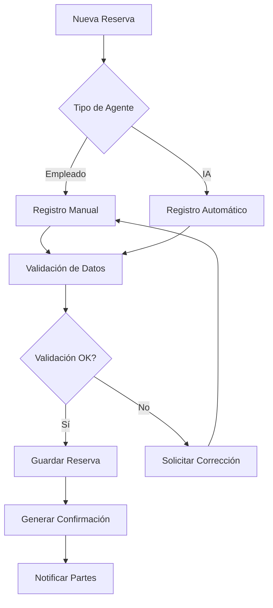
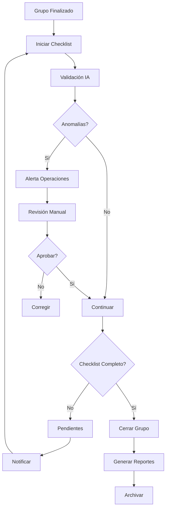

# 📊 Sistema de Control de Reservas y Operaciones - Spirit Tours
## Análisis Completo y Propuesta de Implementación

---

## 📋 Índice

1. [Resumen Ejecutivo](#resumen-ejecutivo)
2. [Análisis del Sistema Actual](#análisis-del-sistema-actual)
3. [Propuesta: Módulo de Control de Reservas](#propuesta-módulo-de-control-de-reservas)
4. [Sistema de Cierre de Grupos](#sistema-de-cierre-de-grupos)
5. [Arquitectura Técnica](#arquitectura-técnica)
6. [Modelos de Datos](#modelos-de-datos)
7. [Flujos de Trabajo](#flujos-de-trabajo)
8. [Integraciones con IA](#integraciones-con-ia)
9. [Sistema de Permisos y Seguridad](#sistema-de-permisos-y-seguridad)
10. [Plan de Implementación](#plan-de-implementación)

---

## 1. 📌 Resumen Ejecutivo

### Necesidades Identificadas

Spirit Tours requiere un sistema integral de control de reservas y operaciones que permita:

1. **Control Total de Reservas**: Gestión centralizada de todas las reservas con proveedores
2. **Seguimiento de Confirmaciones**: Control de números de confirmación, contactos y detalles
3. **Cierre de Grupos**: Sistema de checklist para cierre operativo y financiero
4. **Detección de Fraudes**: Validación automática de facturas vs servicios contratados
5. **Control de Acceso**: Sistema basado en roles con permisos específicos

### Solución Propuesta

Desarrollar un **Módulo de Control de Operaciones (MCO)** integrado en el dashboard administrativo con:
- Panel de control de reservas multi-proveedor
- Sistema de cierre de grupos con validación
- Integración con IA para detección de anomalías
- Sistema de alertas y notificaciones
- Control de acceso basado en roles

---

## 2. 🔍 Análisis del Sistema Actual

### Fortalezas Existentes
- ✅ Sistema RBAC (Role-Based Access Control) implementado
- ✅ Modelos de negocio B2B/B2C/B2B2C
- ✅ Sistema de auditoría y logs
- ✅ Integración con múltiples proveedores
- ✅ Dashboard administrativo funcional

### Brechas Identificadas
- ❌ No existe control centralizado de reservas con proveedores
- ❌ Falta sistema de validación de facturas
- ❌ No hay checklist para cierre de grupos
- ❌ Ausencia de detección automática de anomalías
- ❌ Falta integración para control de operaciones

### Oportunidades de Mejora
- 🔄 Automatización de procesos operativos
- 🔄 Reducción de errores manuales
- 🔄 Mejora en detección de fraudes
- 🔄 Optimización del flujo de trabajo
- 🔄 Mayor transparencia operativa

---

## 3. 🎯 Propuesta: Módulo de Control de Reservas

### 3.1 Estructura del Sistema

```
┌─────────────────────────────────────────────────────────┐
│           MÓDULO DE CONTROL DE OPERACIONES              │
├─────────────────────────────────────────────────────────┤
│                                                         │
│  ┌──────────────┐  ┌──────────────┐  ┌──────────────┐ │
│  │   RESERVAS   │  │   GRUPOS     │  │  PROVEEDORES │ │
│  │              │  │              │  │              │ │
│  │ • Hoteles    │  │ • Activos    │  │ • Contratos  │ │
│  │ • Transporte │  │ • Cerrados   │  │ • Tarifas    │ │
│  │ • Entradas   │  │ • Pendientes │  │ • Políticas  │ │
│  │ • Guías      │  │              │  │              │ │
│  └──────────────┘  └──────────────┘  └──────────────┘ │
│                                                         │
│  ┌──────────────┐  ┌──────────────┐  ┌──────────────┐ │
│  │  VALIDACIÓN  │  │   ALERTAS    │  │  REPORTES    │ │
│  │              │  │              │  │              │ │
│  │ • Facturas   │  │ • Email      │  │ • Operativo  │ │
│  │ • Rooming    │  │ • Dashboard  │  │ • Financiero │ │
│  │ • Servicios  │  │ • WhatsApp   │  │ • Auditoría  │ │
│  └──────────────┘  └──────────────┘  └──────────────┘ │
└─────────────────────────────────────────────────────────┘
```

### 3.2 Funcionalidades Principales

#### A. Gestión de Reservas

**Características:**
- Registro centralizado de todas las reservas
- Control por tipo de servicio (hotel, transporte, entradas, etc.)
- Seguimiento de confirmaciones y modificaciones
- Histórico de cambios y versiones

**Campos de Control:**
```python
- reservation_id: ID único de reserva
- provider_id: ID del proveedor
- service_type: Tipo de servicio
- group_id: ID del grupo asociado
- confirmation_number: Número de confirmación
- confirmed_by: Persona que confirmó
- confirmed_at: Fecha/hora de confirmación
- agent_id: Agente responsable (empleado o IA)
- status: Estado de la reserva
- notes: Notas importantes
- documents: Documentos adjuntos
```

#### B. Sistema de Búsqueda Avanzada

**Filtros Disponibles:**
- Por proveedor
- Por tipo de servicio
- Por fecha/rango de fechas
- Por grupo
- Por estado (confirmado, pendiente, cancelado)
- Por agente responsable
- Por políticas de cancelación
- Por estado de pago

**Búsquedas Predefinidas:**
- Reservas pendientes de confirmación
- Próximas a vencer política de cancelación
- Pendientes de pago
- Con anomalías detectadas

### 3.3 Panel de Control (Dashboard)

```typescript
interface OperationsDashboard {
  // Métricas en Tiempo Real
  metrics: {
    activeGroups: number;
    pendingReservations: number;
    upcomingServices: number;
    pendingPayments: number;
    alertsCount: number;
  };
  
  // Vista de Calendario
  calendar: {
    dailyView: ServiceSchedule[];
    weeklyView: GroupSchedule[];
    monthlyView: OperationalOverview;
  };
  
  // Alertas y Notificaciones
  alerts: {
    critical: Alert[];  // Requieren acción inmediata
    warning: Alert[];   // Próximos a vencer
    info: Alert[];     // Informativos
  };
}
```

---

## 4. ✅ Sistema de Cierre de Grupos

### 4.1 Checklist de Cierre

```
┌────────────────────────────────────────────────┐
│         CHECKLIST DE CIERRE DE GRUPO          │
├────────────────────────────────────────────────┤
│                                                │
│ Grupo: [NOMBRE_GRUPO]                         │
│ Fechas: [FECHA_INICIO] - [FECHA_FIN]          │
│ Operador: [NOMBRE_OPERADOR]                   │
│                                                │
├────────────────────────────────────────────────┤
│ SERVICIOS        │ FACTURA │ PAGADO │ VALIDADO│
├──────────────────┼─────────┼────────┼─────────┤
│ ✅ Hotel 1       │   ✅    │   ✅   │   ✅    │
│ ⚠️ Hotel 2       │   ❌    │   ⚠️   │   ✅    │
│ ✅ Transporte    │   ✅    │   ✅   │   ✅    │
│ ✅ Entradas      │   ✅    │   ✅   │   ✅    │
│ ❌ Guía Local    │   ❌    │   ❌   │   ❌    │
├──────────────────┴─────────┴────────┴─────────┤
│                                                │
│ Estado: ⚠️ PENDIENTE DE CIERRE                 │
│ Progreso: ████████░░ 80%                      │
│                                                │
│ [VALIDAR Y CERRAR] [EXPORTAR] [NOTIFICAR]     │
└────────────────────────────────────────────────┘
```

### 4.2 Proceso de Validación

#### Validación Automática (IA)
1. **Comparación Rooming List**
   - Validar número de habitaciones
   - Verificar tipos de habitación
   - Confirmar fechas de estancia
   - Comparar tarifas acordadas

2. **Validación de Facturas**
   - Verificar cantidades facturadas
   - Comparar con servicios contratados
   - Detectar discrepancias en precios
   - Identificar cargos no autorizados

3. **Detección de Anomalías**
   ```python
   anomaly_rules = {
       'rooming_mismatch': check_rooming_vs_booking,
       'price_variance': check_price_deviation,
       'quantity_error': check_service_quantity,
       'date_mismatch': check_service_dates,
       'duplicate_charge': check_duplicate_invoices
   }
   ```

#### Validación Manual
- Revisión por agente de operaciones
- Aprobación de excepciones
- Notas y justificaciones
- Escalamiento a supervisor si necesario

### 4.3 Sistema de Alertas

**Tipos de Alertas:**
```typescript
enum AlertType {
  MISSING_INVOICE = 'missing_invoice',
  PAYMENT_PENDING = 'payment_pending',
  ANOMALY_DETECTED = 'anomaly_detected',
  DEADLINE_APPROACHING = 'deadline_approaching',
  GROUP_NOT_CLOSED = 'group_not_closed'
}

interface Alert {
  id: string;
  type: AlertType;
  severity: 'critical' | 'warning' | 'info';
  group_id: string;
  message: string;
  action_required: string;
  assigned_to: string[];
  created_at: Date;
  deadline: Date;
}
```

---

## 5. 🏗️ Arquitectura Técnica

### 5.1 Stack Tecnológico

```yaml
Backend:
  - Python/FastAPI: APIs REST
  - SQLAlchemy: ORM
  - PostgreSQL: Base de datos principal
  - Redis: Cache y colas
  - Celery: Tareas asíncronas
  
Frontend:
  - React/Next.js: Dashboard
  - TypeScript: Type safety
  - TailwindCSS: Estilos
  - React Query: Estado y cache
  - Chart.js: Visualizaciones
  
IA/ML:
  - OpenAI API: Procesamiento inteligente
  - TensorFlow: Detección de anomalías
  - Pandas: Análisis de datos
  - Scikit-learn: Modelos predictivos
```

### 5.2 Arquitectura de Microservicios

```
┌─────────────────────────────────────────────────────┐
│                   API Gateway                       │
├─────────────────────────────────────────────────────┤
         │              │              │
    ┌────▼────┐    ┌────▼────┐    ┌────▼────┐
    │Reservas │    │ Grupos  │    │Validación│
    │Service  │    │Service  │    │ Service  │
    └─────────┘    └─────────┘    └─────────┘
         │              │              │
    ┌────▼────────────────────────────▼────┐
    │          Database Layer              │
    │         (PostgreSQL + Redis)         │
    └───────────────────────────────────────┘
```

---

## 6. 📊 Modelos de Datos

### 6.1 Modelo de Reservas

```python
class ProviderReservation(Base):
    __tablename__ = 'provider_reservations'
    
    id = Column(UUID, primary_key=True)
    provider_id = Column(UUID, ForeignKey('providers.id'))
    group_id = Column(UUID, ForeignKey('tour_groups.id'))
    service_type = Column(Enum(ServiceType))
    
    # Detalles de Confirmación
    confirmation_number = Column(String(100))
    confirmation_date = Column(DateTime)
    confirmed_by_name = Column(String(200))
    confirmed_by_email = Column(String(200))
    confirmed_by_phone = Column(String(50))
    
    # Detalles del Servicio
    service_date_start = Column(DateTime)
    service_date_end = Column(DateTime)
    quantity = Column(Integer)  # Habitaciones, asientos, etc.
    unit_price = Column(Decimal(12, 2))
    total_price = Column(Decimal(12, 2))
    currency = Column(String(3))
    
    # Políticas
    cancellation_policy = Column(JSON)
    cancellation_deadline = Column(DateTime)
    modification_deadline = Column(DateTime)
    
    # Control Interno
    agent_id = Column(UUID, ForeignKey('users.id'))
    agent_type = Column(Enum(AgentType))  # EMPLOYEE, AI_AGENT
    notes = Column(Text)
    internal_notes = Column(Text)  # Solo visible internamente
    
    # Estado y Pago
    status = Column(Enum(ReservationStatus))
    payment_status = Column(Enum(PaymentStatus))
    invoice_number = Column(String(100))
    invoice_date = Column(DateTime)
    invoice_validated = Column(Boolean, default=False)
    
    # Auditoría
    created_at = Column(DateTime, default=datetime.utcnow)
    updated_at = Column(DateTime, onupdate=datetime.utcnow)
    created_by = Column(UUID, ForeignKey('users.id'))
    updated_by = Column(UUID, ForeignKey('users.id'))
    
    # Relaciones
    provider = relationship('Provider', back_populates='reservations')
    group = relationship('TourGroup', back_populates='reservations')
    agent = relationship('User', foreign_keys=[agent_id])
    attachments = relationship('ReservationAttachment', back_populates='reservation')
    validation_logs = relationship('ValidationLog', back_populates='reservation')
```

### 6.2 Modelo de Grupos

```python
class TourGroup(Base):
    __tablename__ = 'tour_groups'
    
    id = Column(UUID, primary_key=True)
    code = Column(String(50), unique=True)
    name = Column(String(200))
    
    # Información del Tour
    tour_operator_id = Column(UUID, ForeignKey('tour_operators.id'))
    travel_agency_id = Column(UUID, ForeignKey('travel_agencies.id'))
    
    # Fechas
    start_date = Column(DateTime)
    end_date = Column(DateTime)
    booking_date = Column(DateTime)
    
    # Participantes
    total_participants = Column(Integer)
    adults = Column(Integer)
    children = Column(Integer)
    infants = Column(Integer)
    
    # Estado Operativo
    operational_status = Column(Enum(OperationalStatus))
    closure_status = Column(Enum(ClosureStatus))
    closure_date = Column(DateTime)
    closed_by = Column(UUID, ForeignKey('users.id'))
    
    # Checklist de Cierre
    closure_checklist = Column(JSON)  # Estado del checklist
    
    # Financiero
    total_revenue = Column(Decimal(12, 2))
    total_cost = Column(Decimal(12, 2))
    total_commission = Column(Decimal(12, 2))
    
    # Relaciones
    reservations = relationship('ProviderReservation', back_populates='group')
    participants = relationship('GroupParticipant', back_populates='group')
    closure_items = relationship('GroupClosureItem', back_populates='group')
```

### 6.3 Modelo de Validación

```python
class ValidationLog(Base):
    __tablename__ = 'validation_logs'
    
    id = Column(UUID, primary_key=True)
    reservation_id = Column(UUID, ForeignKey('provider_reservations.id'))
    validation_type = Column(Enum(ValidationType))
    
    # Resultados
    status = Column(Enum(ValidationStatus))  # PASSED, FAILED, WARNING
    anomalies_detected = Column(JSON)
    confidence_score = Column(Float)  # 0-1
    
    # Detalles
    expected_values = Column(JSON)
    actual_values = Column(JSON)
    discrepancies = Column(JSON)
    
    # Acciones
    action_taken = Column(Text)
    resolved = Column(Boolean, default=False)
    resolved_by = Column(UUID, ForeignKey('users.id'))
    resolution_notes = Column(Text)
    
    # Timestamps
    validated_at = Column(DateTime, default=datetime.utcnow)
    resolved_at = Column(DateTime)
```

---

## 7. 🔄 Flujos de Trabajo

### 7.1 Flujo de Creación de Reserva



### 7.2 Flujo de Cierre de Grupo



---

## 8. 🤖 Integraciones con IA

### 8.1 Agente IA de Validación

```python
class AIValidationAgent:
    """Agente IA para validación automática de reservas y facturas"""
    
    def validate_rooming_list(self, reservation, rooming_file):
        """
        Valida que el rooming list coincida con la reserva
        """
        # 1. Extraer información del archivo
        rooming_data = self.extract_rooming_data(rooming_file)
        
        # 2. Comparar con reserva
        discrepancies = []
        
        # Verificar cantidades
        if rooming_data['total_rooms'] != reservation.quantity:
            discrepancies.append({
                'type': 'ROOM_COUNT_MISMATCH',
                'expected': reservation.quantity,
                'actual': rooming_data['total_rooms']
            })
        
        # Verificar fechas
        if rooming_data['check_in'] != reservation.service_date_start:
            discrepancies.append({
                'type': 'DATE_MISMATCH',
                'field': 'check_in',
                'expected': reservation.service_date_start,
                'actual': rooming_data['check_in']
            })
        
        # 3. Generar score de confianza
        confidence = self.calculate_confidence(discrepancies)
        
        return {
            'valid': len(discrepancies) == 0,
            'discrepancies': discrepancies,
            'confidence': confidence,
            'recommendations': self.generate_recommendations(discrepancies)
        }
    
    def detect_invoice_anomalies(self, invoice, expected_services):
        """
        Detecta anomalías en facturas comparando con servicios esperados
        """
        anomalies = []
        
        # Detectar servicios no autorizados
        for item in invoice.items:
            if not self.is_service_authorized(item, expected_services):
                anomalies.append({
                    'type': 'UNAUTHORIZED_CHARGE',
                    'item': item,
                    'severity': 'HIGH'
                })
        
        # Detectar variaciones de precio
        for service in expected_services:
            invoice_item = self.find_matching_item(service, invoice.items)
            if invoice_item:
                price_variance = abs(invoice_item.price - service.agreed_price)
                if price_variance > service.agreed_price * 0.05:  # 5% tolerancia
                    anomalies.append({
                        'type': 'PRICE_VARIANCE',
                        'service': service.name,
                        'expected': service.agreed_price,
                        'actual': invoice_item.price,
                        'variance': price_variance,
                        'severity': 'MEDIUM'
                    })
        
        return anomalies
```

### 8.2 Asistente IA para Operaciones

```typescript
interface AIOperationsAssistant {
  // Sugerencias proactivas
  suggestOptimizations(group: TourGroup): Optimization[];
  
  // Predicción de problemas
  predictIssues(reservations: Reservation[]): PotentialIssue[];
  
  // Automatización de tareas
  autoCompleteChecklist(group: TourGroup): ChecklistItem[];
  
  // Análisis de patrones
  analyzeProviderPerformance(provider: Provider): PerformanceReport;
  
  // Recomendaciones
  recommendActions(alerts: Alert[]): ActionRecommendation[];
}
```

---

## 9. 🔐 Sistema de Permisos y Seguridad

### 9.1 Roles y Permisos

```python
class OperationsPermissions(Enum):
    # Visualización
    VIEW_ALL_RESERVATIONS = "operations.view_all_reservations"
    VIEW_OWN_RESERVATIONS = "operations.view_own_reservations"
    VIEW_GROUP_DETAILS = "operations.view_group_details"
    VIEW_FINANCIAL_DATA = "operations.view_financial_data"
    
    # Gestión de Reservas
    CREATE_RESERVATION = "operations.create_reservation"
    EDIT_RESERVATION = "operations.edit_reservation"
    CANCEL_RESERVATION = "operations.cancel_reservation"
    VALIDATE_RESERVATION = "operations.validate_reservation"
    
    # Cierre de Grupos
    INITIATE_GROUP_CLOSURE = "operations.initiate_group_closure"
    VALIDATE_INVOICES = "operations.validate_invoices"
    APPROVE_CLOSURE = "operations.approve_closure"
    OVERRIDE_VALIDATION = "operations.override_validation"
    
    # Administración
    MANAGE_PROVIDERS = "operations.manage_providers"
    CONFIGURE_ALERTS = "operations.configure_alerts"
    EXPORT_REPORTS = "operations.export_reports"
    ACCESS_AUDIT_LOGS = "operations.access_audit_logs"
```

### 9.2 Matriz de Acceso

| Rol | Permisos |
|-----|----------|
| **Director** | Todos los permisos |
| **Administrador** | Todos excepto override_validation |
| **Jefe de Operaciones** | Gestión completa de reservas y grupos |
| **Agente de Operaciones** | Crear/editar reservas, ver grupos |
| **Agente de Ventas** | Ver reservas propias |
| **Contador** | Ver datos financieros, validar facturas |

### 9.3 Control de Acceso

```python
@router.get("/reservations/{reservation_id}")
@require_permission(OperationsPermissions.VIEW_ALL_RESERVATIONS)
async def get_reservation(
    reservation_id: UUID,
    current_user: User = Depends(get_current_user),
    db: Session = Depends(get_db)
):
    # Verificar permisos adicionales
    if not current_user.has_permission(OperationsPermissions.VIEW_ALL_RESERVATIONS):
        # Verificar si es su propia reserva
        reservation = db.query(ProviderReservation).filter(
            ProviderReservation.id == reservation_id,
            ProviderReservation.agent_id == current_user.id
        ).first()
        
        if not reservation:
            raise HTTPException(403, "No tiene permisos para ver esta reserva")
    
    return reservation
```

---

## 10. 📅 Plan de Implementación

### Fase 1: Infraestructura Base (2 semanas)

**Semana 1:**
- [ ] Crear modelos de datos
- [ ] Configurar base de datos
- [ ] Implementar APIs básicas
- [ ] Configurar sistema de permisos

**Semana 2:**
- [ ] Desarrollar servicios de reservas
- [ ] Implementar validaciones básicas
- [ ] Crear sistema de notificaciones
- [ ] Pruebas unitarias

### Fase 2: Dashboard de Operaciones (2 semanas)

**Semana 3:**
- [ ] Diseñar interfaz de usuario
- [ ] Implementar vistas de reservas
- [ ] Crear formularios de gestión
- [ ] Integrar búsqueda avanzada

**Semana 4:**
- [ ] Desarrollar panel de control
- [ ] Implementar calendario operativo
- [ ] Crear sistema de alertas visuales
- [ ] Pruebas de integración

### Fase 3: Sistema de Cierre (2 semanas)

**Semana 5:**
- [ ] Implementar checklist de cierre
- [ ] Desarrollar validación de facturas
- [ ] Crear flujo de aprobación
- [ ] Integrar detección de anomalías

**Semana 6:**
- [ ] Implementar reportes de cierre
- [ ] Desarrollar sistema de archivo
- [ ] Crear auditoría de cierre
- [ ] Pruebas end-to-end

### Fase 4: Integración IA (1 semana)

**Semana 7:**
- [ ] Integrar agente de validación IA
- [ ] Implementar detección automática
- [ ] Configurar aprendizaje automático
- [ ] Pruebas y ajustes

### Fase 5: Despliegue y Capacitación (1 semana)

**Semana 8:**
- [ ] Migración de datos históricos
- [ ] Despliegue en producción
- [ ] Capacitación de usuarios
- [ ] Documentación final

---

## 📈 Métricas de Éxito

### KPIs Operativos
- **Reducción de errores**: -80% en discrepancias de facturación
- **Tiempo de cierre**: -60% en tiempo promedio de cierre de grupos
- **Detección de fraudes**: 95% de anomalías detectadas automáticamente
- **Satisfacción del equipo**: +40% en eficiencia operativa

### KPIs Financieros
- **Ahorro en costos**: -30% en sobrecostos por errores
- **Recuperación de pagos**: +25% en velocidad de cobro
- **Reducción de pérdidas**: -90% en pérdidas por fraude

---

## 🚀 Recomendaciones Adicionales

### 1. Integraciones Futuras
- **WhatsApp Business API**: Notificaciones directas a proveedores
- **OCR Avanzado**: Lectura automática de facturas PDF
- **Blockchain**: Registro inmutable de transacciones
- **RPA**: Automatización de procesos repetitivos

### 2. Mejoras de IA
- **Predicción de demanda**: Anticipar necesidades de reservas
- **Optimización de costos**: Sugerir mejores tarifas
- **Análisis predictivo**: Identificar patrones de fraude
- **Chatbot operativo**: Asistente 24/7 para operaciones

### 3. Expansión del Sistema
- **App móvil para operaciones**: Gestión en campo
- **Portal de proveedores**: Auto-servicio para actualizar disponibilidad
- **Sistema de scoring**: Calificación automática de proveedores
- **Marketplace interno**: Gestión de inventario compartido

### 4. Seguridad Adicional
- **2FA obligatorio**: Para acciones críticas
- **Firma digital**: En documentos importantes
- **Encriptación end-to-end**: Para datos sensibles
- **Audit trail blockchain**: Registro inmutable

---

## 💡 Conclusión

La implementación de este Sistema de Control de Reservas y Operaciones transformará la eficiencia operativa de Spirit Tours, proporcionando:

1. **Control Total**: Visibilidad completa de todas las operaciones
2. **Automatización**: Reducción significativa de tareas manuales
3. **Seguridad**: Detección proactiva de fraudes y errores
4. **Eficiencia**: Optimización del flujo de trabajo
5. **Transparencia**: Trazabilidad completa de todas las acciones

El sistema propuesto no solo resuelve las necesidades actuales, sino que también prepara a Spirit Tours para escalar sus operaciones de manera eficiente y segura.

---

## 📞 Próximos Pasos

1. **Validación de la propuesta** con el equipo directivo
2. **Refinamiento de requerimientos** específicos
3. **Selección de tecnologías** definitivas
4. **Formación del equipo** de desarrollo
5. **Inicio de la Fase 1** de implementación

---

*Documento preparado para Spirit Tours - Sistema de Control de Operaciones*
*Versión 1.0 - Octubre 2024*