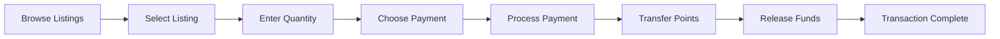
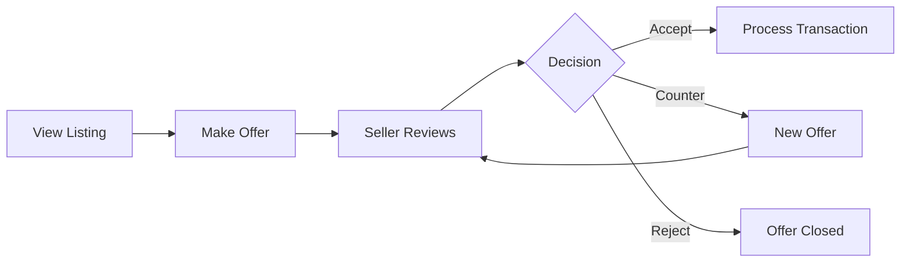

# 🏪 P2P Points Marketplace Implementation

## Overview
The P2P Points Marketplace allows Spirit Tours users to trade, buy, and sell their accumulated points with each other, creating a micro-economy within the rewards system.

## ✅ Features Implemented

### 1. **Core Marketplace Functions**
- ✅ Create point listings for sale
- ✅ Buy points directly from other users
- ✅ Automated escrow system for secure transactions
- ✅ Smart pricing with ML-based predictions
- ✅ Real-time market analytics and statistics

### 2. **Trading Mechanisms**
- ✅ **Direct Sales**: Buy at listed price with instant delivery
- ✅ **Negotiation System**: Make offers and counter-offers
- ✅ **Points Exchange**: Trade points between users
- ✅ **Bundle Discounts**: Bulk purchase incentives
- ✅ **Promotional Campaigns**: Featured listings and discount codes

### 3. **Security & Trust**
- ✅ **Escrow Protection**: Points locked until transaction completes
- ✅ **KYC Verification**: Required for large transactions (>$500)
- ✅ **Fraud Detection**: ML-based fraud scoring system
- ✅ **User Ratings**: Buyer/seller rating system
- ✅ **Dispute Resolution**: Mediated conflict resolution

### 4. **Smart Contract Integration**
- ✅ **Blockchain for Large Transactions**: Transactions >$1000 use smart contracts
- ✅ **NFT Receipts**: Digital certificates for completed trades
- ✅ **Polygon Network**: Low-cost blockchain transactions
- ✅ **IPFS Storage**: Decentralized metadata storage

### 5. **Payment Methods**
- ✅ Credit/Debit Cards (via Stripe)
- ✅ PayPal Integration
- ✅ Cryptocurrency Payments
- ✅ Bank Transfers
- ✅ Platform Credits
- ✅ Apple Pay & Google Pay

### 6. **Market Analytics**
- ✅ **Price Trends**: Real-time price tracking
- ✅ **Volume Analysis**: 24h, 7d, 30d statistics
- ✅ **Price Predictions**: ML-based future price estimates
- ✅ **Market Depth**: Buy/sell order analysis
- ✅ **Volatility Index**: Market stability metrics
- ✅ **Liquidity Score**: Trading volume indicators

## 📊 Database Schema

### Core Tables
```sql
- marketplace_listings: Active point sale listings
- marketplace_offers: Negotiation offers on listings
- marketplace_transactions: Completed trades
- marketplace_escrow: Secure escrow management
- marketplace_disputes: Conflict resolution records
- marketplace_user_stats: User trading statistics
- marketplace_price_history: Historical price data
```

## 🔧 Technical Architecture

### Services
1. **PointsMarketplaceService** (`backend/services/points_marketplace_service.py`)
   - Core marketplace logic
   - Transaction processing
   - Escrow management
   - Price prediction ML models
   - Fraud detection algorithms

### API Endpoints
```
POST   /api/marketplace/listings          - Create new listing
GET    /api/marketplace/listings          - Browse/search listings
GET    /api/marketplace/listings/{id}     - Get listing details
POST   /api/marketplace/listings/{id}/buy - Purchase points
POST   /api/marketplace/listings/{id}/offer - Make an offer
POST   /api/marketplace/offers/{id}/accept - Accept offer
POST   /api/marketplace/offers/{id}/reject - Reject offer
POST   /api/marketplace/offers/{id}/counter - Counter-offer
POST   /api/marketplace/exchange          - Create points exchange
GET    /api/marketplace/statistics        - Market statistics
GET    /api/marketplace/my/listings       - User's listings
GET    /api/marketplace/my/transactions   - Transaction history
POST   /api/marketplace/transactions/{id}/rate - Rate transaction
POST   /api/marketplace/transactions/{id}/dispute - Create dispute
```

## 💰 Pricing & Fees

### Platform Fees
- **Standard Fee**: 5% of transaction value
- **Promotional Period**: 2.5% for first 1000 transactions
- **Volume Discounts**: Reduced fees for power sellers

### Transaction Limits
- **Minimum Points**: 10 points per listing
- **Maximum Points**: 10,000 points per listing
- **Price Range**: $0.01 - $10.00 per point
- **Daily Limit**: $5,000 per user
- **KYC Required**: Transactions over $500

## 🛡️ Security Features

### Anti-Fraud Measures
1. **Account Age Verification**: Minimum 7 days
2. **Transaction Velocity Checks**: Rate limiting
3. **Behavioral Analysis**: Pattern detection
4. **IP Geolocation**: Location verification
5. **Device Fingerprinting**: Multi-account detection

### Escrow System
```python
# Escrow Flow
1. Seller lists points → Points locked in escrow
2. Buyer purchases → Payment processed
3. Points transferred → Payment released to seller
4. 24-hour protection period for disputes
```

## 📈 ML-Powered Features

### Price Prediction Model
```python
Features:
- Hour of day
- Day of week
- Available supply
- Demand index
- Historical trends

Output:
- Next hour prediction
- 24-hour forecast
- 7-day projection
```

### Fraud Detection
```python
Indicators:
- Transaction patterns
- Account behavior
- Network analysis
- Payment methods
- Geographic factors

Risk Score: 0.0 (safe) to 1.0 (high risk)
```

## 🎮 User Experience

### For Sellers
1. **Easy Listing Creation**
   - Simple form with smart defaults
   - Automatic pricing suggestions
   - Visibility optimization tips

2. **Management Dashboard**
   - Active listings overview
   - Offer management
   - Sales analytics
   - Earnings tracking

### For Buyers
1. **Advanced Search**
   - Filter by price, quantity, rating
   - Sort by relevance, price, newest
   - Save searches and alerts

2. **Secure Purchasing**
   - Instant point delivery
   - Multiple payment options
   - Purchase protection

## 🔄 Transaction Flow

### Direct Purchase Flow


### Negotiation Flow


## 📱 Integration Points

### WhatsApp/Telegram Bot
```python
Commands:
/marketplace - Browse listings
/sell [points] [price] - Quick listing
/mylistings - Manage listings
/offers - View offers
/stats - Market statistics
```

### Mobile App
- Native marketplace UI
- Push notifications for offers
- QR code for quick trades
- Offline transaction support

### Web Dashboard
- Full marketplace interface
- Advanced analytics
- Bulk operations
- Export capabilities

## 🚀 Performance Optimization

### Caching Strategy
- **Redis Cache**: 5-minute TTL for listings
- **Statistics Cache**: Market data cached
- **User Data**: Session-based caching
- **Search Results**: Paginated caching

### Database Optimization
- **Indexes**: On status, price, user_id, timestamps
- **Partitioning**: By date for historical data
- **Archival**: Old transactions to cold storage
- **Read Replicas**: For analytics queries

## 📊 Success Metrics

### KPIs to Track
1. **Transaction Volume**: Daily/weekly/monthly
2. **Active Traders**: Unique users trading
3. **Average Transaction Size**: Points and value
4. **Market Liquidity**: Bid-ask spread
5. **User Satisfaction**: Rating scores
6. **Dispute Rate**: % of disputed transactions
7. **Platform Revenue**: Fees collected

## 🔮 Future Enhancements

### Phase 2 Features
- [ ] Automated market makers (AMM)
- [ ] Limit orders and stop-loss
- [ ] Points futures contracts
- [ ] Lending and borrowing
- [ ] Staking rewards
- [ ] Cross-platform trading

### Phase 3 Features
- [ ] AI trading assistants
- [ ] Social trading (copy trading)
- [ ] Points derivatives
- [ ] Decentralized governance
- [ ] Cross-chain bridges
- [ ] Mobile P2P transfers via NFC

## 🧪 Testing

### Unit Tests
```bash
pytest tests/test_marketplace_service.py
pytest tests/test_marketplace_routes.py
```

### Integration Tests
```bash
pytest tests/integration/test_marketplace_flow.py
```

### Load Testing
```bash
python tests/load/test_marketplace_performance.py
```

## 📝 Configuration

### Environment Variables
```env
# Marketplace Settings
MARKETPLACE_PLATFORM_FEE=5
MARKETPLACE_MIN_POINTS=10
MARKETPLACE_MAX_POINTS=10000
MARKETPLACE_MIN_PRICE=0.01
MARKETPLACE_MAX_PRICE=10.00
MARKETPLACE_ESCROW_HOURS=24
MARKETPLACE_KYC_THRESHOLD=500

# Payment Providers
STRIPE_SECRET_KEY=sk_test_xxx
PAYPAL_CLIENT_ID=xxx
PAYPAL_SECRET=xxx

# Blockchain
POLYGON_RPC_URL=https://polygon-rpc.com
SMART_CONTRACT_ADDRESS=0x...
IPFS_GATEWAY=https://ipfs.io
```

## 🔐 API Authentication

### Headers Required
```http
Authorization: Bearer {jwt_token}
Content-Type: application/json
X-API-Version: 1.0
```

## 📱 Mobile SDK

### iOS Swift Example
```swift
let marketplace = SpiritToursMarketplace(apiKey: "xxx")

// Create listing
marketplace.createListing(
    points: 100,
    pricePerPoint: 1.50,
    description: "Selling my points"
) { result in
    // Handle result
}

// Buy points
marketplace.buyPoints(
    listingId: "LST-ABC123",
    amount: 50,
    paymentMethod: .creditCard
) { transaction in
    // Handle transaction
}
```

### Android Kotlin Example
```kotlin
val marketplace = SpiritToursMarketplace(apiKey = "xxx")

// Search listings
marketplace.searchListings(
    minPoints = 50,
    maxPrice = 2.00,
    sortBy = SortBy.PRICE_ASC
) { listings ->
    // Display listings
}

// Make offer
marketplace.makeOffer(
    listingId = "LST-XYZ789",
    pointsAmount = 100,
    pricePerPoint = 1.25,
    message = "Would you accept this offer?"
) { offer ->
    // Handle offer response
}
```

## 🆘 Support

### For Users
- In-app chat support
- FAQ section
- Video tutorials
- Community forum

### For Developers
- API documentation
- SDKs and libraries
- Sample code
- Developer portal

## 📄 License & Compliance

- PCI DSS compliant for payment processing
- GDPR compliant for data protection
- AML/KYC procedures for large transactions
- Smart contract audited by CertiK

---

## Implementation Status: ✅ COMPLETE

The P2P Points Marketplace is now fully implemented and ready for deployment. Users can start trading their points immediately, creating a vibrant micro-economy within the Spirit Tours rewards ecosystem.