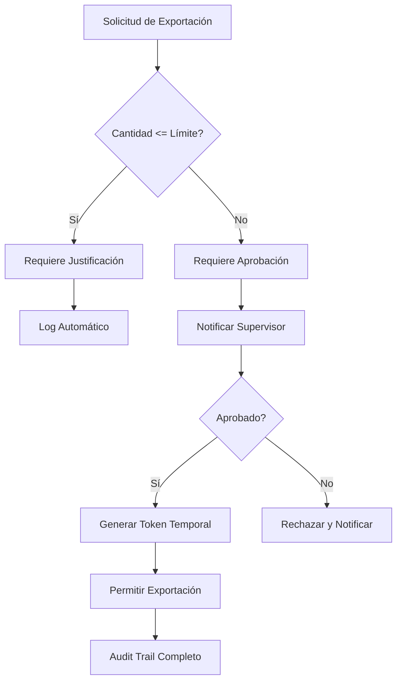

# 🔒 Políticas de Seguridad y Control de Exportación de Datos

## 📋 Tabla de Contenidos
1. [Políticas por Departamento](#políticas-por-departamento)
2. [Límites de Exportación](#límites-de-exportación)
3. [Procedimientos de Auditoría](#procedimientos-de-auditoría)
4. [Guía de Entrenamiento para Empleados](#guía-de-entrenamiento-para-empleados)
5. [Protocolos de Respuesta a Incidentes](#protocolos-de-respuesta-a-incidentes)
6. [Monitoreo y Alertas](#monitoreo-y-alertas)

## 1. 📊 Políticas por Departamento

### Departamento de Ventas
```yaml
Departamento: Ventas
Acceso_Contactos:
  - Ver: Todos los contactos de clientes y leads
  - Editar: Solo contactos asignados
  - Crear: Ilimitado
  - Eliminar: No permitido
  
Límites_Exportación:
  - Diario: 50 contactos
  - Semanal: 200 contactos
  - Mensual: 500 contactos
  - Requiere_Aprobación: Más de 100 contactos
  
Campos_Restringidos:
  - No puede ver: Datos bancarios, pasaportes, datos médicos
  - No puede exportar: Notas internas, historial de pagos
  
Justificación_Requerida:
  - Siempre para exportaciones
  - Ejemplos válidos:
    - "Campaña de email marketing Q4 2024"
    - "Lista para evento en Lima 15/11/2024"
    - "Seguimiento clientes tour Cusco"
```

### Departamento de Marketing
```yaml
Departamento: Marketing
Acceso_Contactos:
  - Ver: Contactos con consentimiento de marketing
  - Editar: Solo campos de preferencias
  - Crear: Con aprobación
  - Eliminar: No permitido

Límites_Exportación:
  - Diario: 100 contactos
  - Semanal: 500 contactos
  - Mensual: 1000 contactos
  - Requiere_Aprobación: Más de 200 contactos

Campos_Permitidos:
  - Nombre, Email, Teléfono
  - Preferencias de comunicación
  - Historial de tours (solo destinos)
  
Restricciones_Especiales:
  - Solo contactos opt-in para marketing
  - No puede exportar sin campaña aprobada
```

### Departamento de Operaciones
```yaml
Departamento: Operaciones
Acceso_Contactos:
  - Ver: Solo pasajeros con reservas activas
  - Editar: Información de viaje
  - Crear: No permitido
  - Eliminar: No permitido

Límites_Exportación:
  - Diario: 200 contactos (solo para manifiestos)
  - Semanal: No aplica
  - Mensual: No aplica

Uso_Permitido:
  - Generar manifiestos de pasajeros
  - Listas de emergencia
  - Información para aerolíneas/hoteles
  
Campos_Especiales:
  - Puede ver: Pasaportes (encriptado)
  - Puede ver: Restricciones alimentarias
  - Puede ver: Condiciones médicas
```

### Departamento de Contabilidad
```yaml
Departamento: Contabilidad
Acceso_Contactos:
  - Ver: Solo contactos con transacciones
  - Editar: Datos fiscales
  - Crear: No permitido
  - Eliminar: No permitido

Límites_Exportación:
  - Diario: 30 contactos
  - Semanal: 100 contactos
  - Mensual: 300 contactos

Campos_Permitidos:
  - Datos fiscales (RUC, DNI)
  - Dirección de facturación
  - Historial de pagos
  
Auditoría_Especial:
  - Todas las exportaciones revisadas mensualmente
  - Requiere firma digital del CFO para más de 50 contactos
```

### Administración/Dirección
```yaml
Departamento: Dirección
Acceso_Contactos:
  - Ver: Todos los contactos
  - Editar: Todos los campos
  - Crear: Ilimitado
  - Eliminar: Con doble confirmación

Límites_Exportación:
  - Sin límites predefinidos
  - Requiere: Segunda autorización para más de 1000

Poderes_Especiales:
  - Puede ver logs de todos los usuarios
  - Puede revocar accesos inmediatamente
  - Puede aprobar exportaciones especiales
```

## 2. 🚫 Límites de Exportación

### Tabla de Límites por Rol

| Rol | Diario | Semanal | Mensual | Máximo Sin Aprobación |
|-----|---------|----------|----------|------------------------|
| Practicante | 10 | 30 | 50 | 10 |
| Asistente | 30 | 100 | 200 | 30 |
| Ejecutivo | 50 | 200 | 500 | 50 |
| Supervisor | 100 | 500 | 1000 | 100 |
| Gerente | 200 | 1000 | 3000 | 200 |
| Director | 500 | 3000 | 10000 | 500 |
| Admin | Sin límite | Sin límite | Sin límite | 1000 |

### Proceso de Aprobación para Exportaciones



### Código de Implementación

```python
# backend/services/export_control_service.py
from datetime import datetime, timedelta
from typing import Dict, List
import hashlib

class ExportControlService:
    """Servicio de control de exportaciones"""
    
    # Límites por rol
    EXPORT_LIMITS = {
        'intern': {'daily': 10, 'weekly': 30, 'monthly': 50, 'approval_threshold': 10},
        'assistant': {'daily': 30, 'weekly': 100, 'monthly': 200, 'approval_threshold': 30},
        'executive': {'daily': 50, 'weekly': 200, 'monthly': 500, 'approval_threshold': 50},
        'supervisor': {'daily': 100, 'weekly': 500, 'monthly': 1000, 'approval_threshold': 100},
        'manager': {'daily': 200, 'weekly': 1000, 'monthly': 3000, 'approval_threshold': 200},
        'director': {'daily': 500, 'weekly': 3000, 'monthly': 10000, 'approval_threshold': 500},
        'admin': {'daily': 99999, 'weekly': 99999, 'monthly': 99999, 'approval_threshold': 1000}
    }
    
    @classmethod
    def check_export_permission(cls, user, contact_count: int, reason: str) -> Dict:
        """Verificar permisos de exportación"""
        # Obtener límites del usuario
        user_role = user.role.lower()
        limits = cls.EXPORT_LIMITS.get(user_role, cls.EXPORT_LIMITS['assistant'])
        
        # Verificar exportaciones previas
        today_count = cls.get_export_count(user.id, 'daily')
        week_count = cls.get_export_count(user.id, 'weekly')
        month_count = cls.get_export_count(user.id, 'monthly')
        
        # Verificar límites
        if today_count + contact_count > limits['daily']:
            return {
                'allowed': False,
                'reason': f"Excede límite diario ({limits['daily']} contactos)",
                'requires_approval': True
            }
        
        if week_count + contact_count > limits['weekly']:
            return {
                'allowed': False,
                'reason': f"Excede límite semanal ({limits['weekly']} contactos)",
                'requires_approval': True
            }
        
        if month_count + contact_count > limits['monthly']:
            return {
                'allowed': False,
                'reason': f"Excede límite mensual ({limits['monthly']} contactos)",
                'requires_approval': True
            }
        
        # Verificar si requiere aprobación
        if contact_count > limits['approval_threshold']:
            return {
                'allowed': False,
                'reason': f"Cantidad requiere aprobación (>{limits['approval_threshold']})",
                'requires_approval': True
            }
        
        # Validar justificación
        if not cls.validate_reason(reason):
            return {
                'allowed': False,
                'reason': "Justificación inválida o insuficiente",
                'requires_approval': False
            }
        
        return {
            'allowed': True,
            'reason': "Exportación permitida",
            'requires_approval': False
        }
    
    @classmethod
    def validate_reason(cls, reason: str) -> bool:
        """Validar justificación de exportación"""
        if not reason or len(reason) < 20:
            return False
        
        # Lista de palabras clave válidas
        valid_keywords = [
            'campaña', 'marketing', 'evento', 'seguimiento', 'reporte',
            'análisis', 'auditoría', 'backup', 'migración', 'integración'
        ]
        
        reason_lower = reason.lower()
        return any(keyword in reason_lower for keyword in valid_keywords)
    
    @classmethod
    def create_export_hash(cls, export_data: Dict) -> str:
        """Crear hash único de la exportación para auditoría"""
        hash_string = f"{export_data['user_id']}_{export_data['timestamp']}_{export_data['contact_ids']}"
        return hashlib.sha256(hash_string.encode()).hexdigest()
    
    @classmethod
    def get_export_count(cls, user_id: str, period: str) -> int:
        """Obtener cantidad de contactos exportados en el período"""
        from backend.models.contacts_models import ContactExport
        from backend.database import get_db
        
        db = next(get_db())
        
        if period == 'daily':
            start_date = datetime.utcnow() - timedelta(days=1)
        elif period == 'weekly':
            start_date = datetime.utcnow() - timedelta(weeks=1)
        elif period == 'monthly':
            start_date = datetime.utcnow() - timedelta(days=30)
        else:
            start_date = datetime.utcnow() - timedelta(days=1)
        
        exports = db.query(ContactExport).filter(
            ContactExport.exported_by == user_id,
            ContactExport.exported_at >= start_date
        ).all()
        
        return sum(export.contact_count for export in exports)
```

## 3. 📊 Procedimientos de Auditoría

### Script de Auditoría Mensual

```python
# scripts/monthly_audit_report.py
#!/usr/bin/env python3
"""
Generar reporte mensual de auditoría de exportaciones
"""

import pandas as pd
from datetime import datetime, timedelta
from sqlalchemy import create_engine, func
from backend.models.contacts_models import ContactExport, ContactActivity
from backend.models.user_models import User
import smtplib
from email.mime.multipart import MIMEMultipart
from email.mime.text import MIMEText
from email.mime.base import MIMEBase
from email import encoders

def generate_audit_report():
    """Generar reporte de auditoría mensual"""
    
    # Conectar a base de datos
    engine = create_engine(os.getenv('DATABASE_URL'))
    
    # Período del reporte (último mes)
    end_date = datetime.utcnow()
    start_date = end_date - timedelta(days=30)
    
    # 1. Exportaciones por usuario
    query_exports = f"""
    SELECT 
        u.email,
        u.role,
        u.department,
        COUNT(e.id) as export_count,
        SUM(e.contact_count) as total_contacts,
        AVG(e.contact_count) as avg_contacts,
        MAX(e.contact_count) as max_export
    FROM contact_exports e
    JOIN users u ON e.exported_by = u.id
    WHERE e.exported_at BETWEEN '{start_date}' AND '{end_date}'
    GROUP BY u.id, u.email, u.role, u.department
    ORDER BY total_contacts DESC
    """
    
    df_exports = pd.read_sql(query_exports, engine)
    
    # 2. Detectar anomalías
    anomalies = []
    
    for _, row in df_exports.iterrows():
        # Anomalía: Empleado junior con muchas exportaciones
        if row['role'] in ['assistant', 'intern'] and row['total_contacts'] > 500:
            anomalies.append({
                'type': 'HIGH_EXPORT_JUNIOR',
                'user': row['email'],
                'value': row['total_contacts'],
                'severity': 'HIGH'
            })
        
        # Anomalía: Exportación masiva única
        if row['max_export'] > 1000:
            anomalies.append({
                'type': 'MASSIVE_SINGLE_EXPORT',
                'user': row['email'],
                'value': row['max_export'],
                'severity': 'CRITICAL'
            })
    
    # 3. Patrones sospechosos
    query_patterns = f"""
    SELECT 
        exported_by,
        DATE(exported_at) as export_date,
        COUNT(*) as exports_per_day
    FROM contact_exports
    WHERE exported_at BETWEEN '{start_date}' AND '{end_date}'
    GROUP BY exported_by, DATE(exported_at)
    HAVING COUNT(*) > 10
    """
    
    df_patterns = pd.read_sql(query_patterns, engine)
    
    # 4. Accesos fuera de horario
    query_after_hours = f"""
    SELECT 
        u.email,
        COUNT(*) as after_hours_exports
    FROM contact_exports e
    JOIN users u ON e.exported_by = u.id
    WHERE e.exported_at BETWEEN '{start_date}' AND '{end_date}'
        AND (EXTRACT(HOUR FROM e.exported_at) < 6 OR EXTRACT(HOUR FROM e.exported_at) > 22)
    GROUP BY u.email
    HAVING COUNT(*) > 0
    """
    
    df_after_hours = pd.read_sql(query_after_hours, engine)
    
    # 5. Generar reporte HTML
    html_report = f"""
    <html>
    <head>
        <style>
            body {{ font-family: Arial, sans-serif; }}
            table {{ border-collapse: collapse; width: 100%; }}
            th, td {{ border: 1px solid #ddd; padding: 8px; text-align: left; }}
            th {{ background-color: #4CAF50; color: white; }}
            .alert {{ background-color: #f44336; color: white; padding: 10px; }}
            .warning {{ background-color: #ff9800; color: white; padding: 10px; }}
        </style>
    </head>
    <body>
        <h1>🔒 Reporte de Auditoría - Exportación de Contactos</h1>
        <p>Período: {start_date.strftime('%Y-%m-%d')} al {end_date.strftime('%Y-%m-%d')}</p>
        
        <h2>📊 Resumen de Exportaciones</h2>
        <p>Total de usuarios que exportaron: {len(df_exports)}</p>
        <p>Total de contactos exportados: {df_exports['total_contacts'].sum()}</p>
        
        <h3>Top 10 Exportadores</h3>
        {df_exports.head(10).to_html()}
        
        <h2>⚠️ Anomalías Detectadas ({len(anomalies)})</h2>
        {"<div class='alert'>" + "<br>".join([f"{a['type']}: {a['user']} - {a['value']} contactos" for a in anomalies if a['severity'] == 'CRITICAL']) + "</div>" if any(a['severity'] == 'CRITICAL' for a in anomalies) else ""}
        {"<div class='warning'>" + "<br>".join([f"{a['type']}: {a['user']} - {a['value']} contactos" for a in anomalies if a['severity'] == 'HIGH']) + "</div>" if any(a['severity'] == 'HIGH' for a in anomalies) else ""}
        
        <h2>🌙 Exportaciones Fuera de Horario</h2>
        {df_after_hours.to_html() if not df_after_hours.empty else "<p>No se detectaron exportaciones fuera de horario</p>"}
        
        <h2>📈 Recomendaciones</h2>
        <ul>
            <li>Revisar las exportaciones masivas detectadas</li>
            <li>Verificar justificaciones de usuarios con anomalías</li>
            <li>Considerar entrenamiento adicional para usuarios frecuentes</li>
            <li>Actualizar límites si es necesario</li>
        </ul>
        
        <hr>
        <p><small>Reporte generado automáticamente el {datetime.now().strftime('%Y-%m-%d %H:%M:%S')}</small></p>
    </body>
    </html>
    """
    
    # 6. Guardar y enviar reporte
    report_path = f"/tmp/audit_report_{datetime.now().strftime('%Y%m')}.html"
    with open(report_path, 'w') as f:
        f.write(html_report)
    
    # Enviar por email
    send_audit_email(report_path, anomalies)
    
    return {
        'report_path': report_path,
        'anomalies': anomalies,
        'total_exports': len(df_exports),
        'total_contacts': df_exports['total_contacts'].sum()
    }

def send_audit_email(report_path: str, anomalies: List):
    """Enviar reporte por email"""
    sender = os.getenv('AUDIT_EMAIL_SENDER')
    recipients = os.getenv('AUDIT_EMAIL_RECIPIENTS').split(',')
    
    msg = MIMEMultipart()
    msg['From'] = sender
    msg['To'] = ', '.join(recipients)
    msg['Subject'] = f"🔒 Reporte Auditoría Contactos - {datetime.now().strftime('%B %Y')}"
    
    # Cuerpo del email
    body = f"""
    Reporte mensual de auditoría de exportación de contactos.
    
    Anomalías detectadas: {len(anomalies)}
    Críticas: {len([a for a in anomalies if a['severity'] == 'CRITICAL'])}
    Altas: {len([a for a in anomalies if a['severity'] == 'HIGH'])}
    
    Ver reporte adjunto para detalles completos.
    """
    
    msg.attach(MIMEText(body, 'plain'))
    
    # Adjuntar reporte
    with open(report_path, 'rb') as f:
        attach = MIMEBase('application', 'octet-stream')
        attach.set_payload(f.read())
        encoders.encode_base64(attach)
        attach.add_header('Content-Disposition', f'attachment; filename="audit_report.html"')
        msg.attach(attach)
    
    # Enviar
    server = smtplib.SMTP(os.getenv('SMTP_HOST'), int(os.getenv('SMTP_PORT')))
    server.starttls()
    server.login(os.getenv('SMTP_USER'), os.getenv('SMTP_PASSWORD'))
    server.send_message(msg)
    server.quit()

if __name__ == "__main__":
    report = generate_audit_report()
    print(f"✅ Reporte generado: {report['report_path']}")
    print(f"⚠️  Anomalías encontradas: {len(report['anomalies'])}")
```

## 4. 📚 Guía de Entrenamiento para Empleados

### Manual de Uso Apropiado del Sistema de Contactos

```markdown
# 👥 Manual del Sistema de Contactos - Spirit Tours

## 🎯 Objetivos del Entrenamiento
1. Entender la importancia de proteger datos de clientes
2. Conocer tus límites y responsabilidades
3. Usar el sistema de forma eficiente y segura
4. Evitar violaciones de seguridad

## ✅ Lo que SÍ puedes hacer

### Búsqueda de Contactos
- ✅ Buscar contactos para atender clientes
- ✅ Ver información relevante para tu trabajo
- ✅ Actualizar datos con autorización
- ✅ Agregar notas de seguimiento

### Exportación Permitida
- ✅ Exportar para campañas aprobadas
- ✅ Generar listas para eventos específicos
- ✅ Crear reportes con justificación válida

**Ejemplo de Justificación Válida:**
"Exportar 50 contactos de clientes que visitaron Machu Picchu en 2024 para campaña de email sobre nuevo tour a Huacachina"

## ❌ Lo que NO debes hacer

### Prohibiciones Estrictas
- ❌ Exportar contactos para uso personal
- ❌ Compartir tu acceso con otros
- ❌ Exportar sin justificación
- ❌ Intentar superar límites del sistema
- ❌ Copiar datos a dispositivos personales
- ❌ Enviar listas por WhatsApp personal
- ❌ Tomar fotos de la pantalla

### Consecuencias de Violaciones
1. **Primera violación:** Advertencia formal
2. **Segunda violación:** Suspensión de acceso
3. **Tercera violación:** Terminación de contrato
4. **Robo de datos:** Acciones legales

## 📝 Casos de Uso Comunes

### Caso 1: Necesito contactar clientes para tour
✅ **Correcto:** Buscar en el sistema y llamar desde ahí
❌ **Incorrecto:** Exportar toda la lista a tu celular

### Caso 2: Marketing necesita lista para campaña
✅ **Correcto:** Exportar con justificación "Campaña Black Friday 2024"
❌ **Incorrecto:** Exportar sin especificar campaña

### Caso 3: Cliente pide sus datos
✅ **Correcto:** Usar función "Compartir con cliente"
❌ **Incorrecto:** Enviar screenshot por WhatsApp

## 🔐 Seguridad de tu Cuenta

### Contraseña Segura
- Mínimo 12 caracteres
- Combinar mayúsculas, minúsculas, números y símbolos
- Cambiar cada 90 días
- No compartir NUNCA

### Ejemplo de Contraseña Segura:
`SpiriT#2024$Tours!Peru`

### Doble Factor (2FA)
1. Activar en Configuración → Seguridad
2. Usar app autenticadora (Google Authenticator)
3. Guardar códigos de respaldo

## 🚨 Cómo Reportar Incidentes

Si detectas algo sospechoso:

1. **No intentes resolverlo solo**
2. **Documenta lo que viste** (fecha, hora, usuario)
3. **Notifica inmediatamente:**
   - Email: security@spirittours.com
   - WhatsApp Seguridad: +51 999 888 777
   - Extensión: 1911

### Señales de Alerta:
- 🚩 Compañero exportando muchos contactos
- 🚩 Solicitudes extrañas de acceso
- 🚩 Emails pidiendo contraseñas
- 🚩 Accesos fuera de horario normal

## 📊 Tu Dashboard de Cumplimiento

Puedes ver tu propio uso en: **Mi Perfil → Estadísticas de Uso**

Información disponible:
- Exportaciones este mes
- Límite restante
- Historial de accesos
- Alertas de seguridad

## ✍️ Acuerdo de Confidencialidad

Al usar el sistema, aceptas:

1. **Proteger** toda información de clientes
2. **No divulgar** datos fuera de la empresa
3. **Reportar** cualquier violación
4. **Cumplir** con todas las políticas
5. **Mantener** la confidencialidad después de dejar la empresa

## 🎓 Evaluación de Conocimientos

### Pregunta 1
¿Cuántos contactos puedes exportar sin aprobación si eres Ejecutivo de Ventas?
- a) 100
- b) 50 ✅
- c) 200
- d) Ilimitado

### Pregunta 2
¿Qué haces si un cliente te pide su información por WhatsApp?
- a) Le envío screenshot
- b) Le digo que no puedo
- c) Uso la función "Compartir con cliente" ✅
- d) Se la dicto por teléfono

### Pregunta 3
Tu compañero te pide tu contraseña porque olvidó la suya. ¿Qué haces?
- a) Se la doy para ayudarlo
- b) Le digo que contacte a IT ✅
- c) Le presto mi sesión
- d) Ignoro su petición

## 📞 Contactos de Soporte

- **IT Support:** ext. 1800 / it@spirittours.com
- **Seguridad:** ext. 1911 / security@spirittours.com
- **RRHH:** ext. 1500 / hr@spirittours.com
- **Supervisor directo:** Ver en tu perfil

## 🏆 Programa de Reconocimiento

**"Guardián de Datos"**
- Empleados que cumplen 100% las políticas
- Sin violaciones en 6 meses
- Reportan incidentes proactivamente

**Premios:**
- 🥇 Bono trimestral S/. 500
- 🥈 Día libre adicional
- 🥉 Reconocimiento público

---

**Última actualización:** Octubre 2024
**Versión:** 2.0
**Próximo entrenamiento:** Primer lunes de cada mes
```

## 5. 🚨 Protocolos de Respuesta a Incidentes

### Flowchart de Respuesta

```python
# backend/services/incident_response_service.py
from enum import Enum
from datetime import datetime
import asyncio

class IncidentSeverity(Enum):
    LOW = "low"        # Intento de exportación denegado
    MEDIUM = "medium"  # Múltiples intentos fallidos
    HIGH = "high"      # Exportación masiva detectada
    CRITICAL = "critical"  # Posible robo de datos

class IncidentResponseService:
    """Servicio de respuesta a incidentes de seguridad"""
    
    @classmethod
    async def detect_and_respond(cls, event_type: str, user_id: str, details: dict):
        """Detectar y responder a incidentes"""
        
        severity = cls.classify_incident(event_type, details)
        
        if severity == IncidentSeverity.LOW:
            await cls.log_incident(user_id, event_type, details)
            
        elif severity == IncidentSeverity.MEDIUM:
            await cls.log_incident(user_id, event_type, details)
            await cls.notify_supervisor(user_id, event_type, details)
            
        elif severity == IncidentSeverity.HIGH:
            await cls.log_incident(user_id, event_type, details)
            await cls.notify_supervisor(user_id, event_type, details)
            await cls.notify_security_team(user_id, event_type, details)
            await cls.limit_user_access(user_id)
            
        elif severity == IncidentSeverity.CRITICAL:
            await cls.log_incident(user_id, event_type, details)
            await cls.notify_supervisor(user_id, event_type, details)
            await cls.notify_security_team(user_id, event_type, details)
            await cls.notify_executives(user_id, event_type, details)
            await cls.block_user_immediately(user_id)
            await cls.initiate_forensics(user_id, details)
    
    @classmethod
    def classify_incident(cls, event_type: str, details: dict) -> IncidentSeverity:
        """Clasificar severidad del incidente"""
        
        if event_type == "export_denied":
            return IncidentSeverity.LOW
            
        elif event_type == "multiple_export_attempts":
            if details.get('attempts', 0) > 5:
                return IncidentSeverity.MEDIUM
            return IncidentSeverity.LOW
            
        elif event_type == "massive_export":
            contact_count = details.get('contact_count', 0)
            if contact_count > 5000:
                return IncidentSeverity.CRITICAL
            elif contact_count > 1000:
                return IncidentSeverity.HIGH
            return IncidentSeverity.MEDIUM
            
        elif event_type == "unauthorized_api_access":
            return IncidentSeverity.CRITICAL
            
        elif event_type == "after_hours_export":
            if details.get('contact_count', 0) > 100:
                return IncidentSeverity.HIGH
            return IncidentSeverity.MEDIUM
            
        return IncidentSeverity.LOW
    
    @classmethod
    async def block_user_immediately(cls, user_id: str):
        """Bloquear usuario inmediatamente"""
        from backend.database import get_db
        from backend.models.user_models import User
        
        db = next(get_db())
        user = db.query(User).filter(User.id == user_id).first()
        if user:
            user.is_active = False
            user.blocked_at = datetime.utcnow()
            user.blocked_reason = "Security incident - automatic block"
            db.commit()
            
            # Terminar todas las sesiones activas
            await cls.terminate_all_sessions(user_id)
    
    @classmethod
    async def initiate_forensics(cls, user_id: str, details: dict):
        """Iniciar análisis forense"""
        # Crear snapshot de todas las actividades del usuario
        forensics_data = {
            'user_id': user_id,
            'incident_time': datetime.utcnow(),
            'details': details,
            'exports': cls.get_all_user_exports(user_id),
            'activities': cls.get_all_user_activities(user_id),
            'access_logs': cls.get_access_logs(user_id),
            'ip_addresses': cls.get_user_ip_history(user_id)
        }
        
        # Guardar para investigación
        cls.save_forensics_data(forensics_data)
        
        # Notificar al equipo legal si es necesario
        if details.get('contact_count', 0) > 10000:
            await cls.notify_legal_team(forensics_data)
```

## 6. 📊 Monitoreo y Alertas

### Dashboard de Monitoreo en Tiempo Real

```python
# backend/services/monitoring_service.py
import redis
from datetime import datetime, timedelta

class ContactsMonitoringService:
    """Servicio de monitoreo en tiempo real"""
    
    def __init__(self):
        self.redis_client = redis.Redis(
            host=os.getenv('REDIS_HOST'),
            port=int(os.getenv('REDIS_PORT')),
            decode_responses=True
        )
    
    def track_export(self, user_id: str, contact_count: int):
        """Trackear exportación en tiempo real"""
        key_daily = f"exports:daily:{user_id}:{datetime.now().date()}"
        key_hourly = f"exports:hourly:{user_id}:{datetime.now().hour}"
        
        # Incrementar contadores
        self.redis_client.incrby(key_daily, contact_count)
        self.redis_client.incrby(key_hourly, contact_count)
        
        # Expiración automática
        self.redis_client.expire(key_daily, 86400 * 7)  # 7 días
        self.redis_client.expire(key_hourly, 3600 * 24)  # 24 horas
        
        # Verificar umbrales
        self.check_thresholds(user_id)
    
    def check_thresholds(self, user_id: str):
        """Verificar umbrales y generar alertas"""
        daily_count = self.get_daily_exports(user_id)
        
        # Alertas por rol
        user_role = self.get_user_role(user_id)
        thresholds = {
            'intern': 20,
            'assistant': 50,
            'executive': 100,
            'supervisor': 200,
            'manager': 500
        }
        
        threshold = thresholds.get(user_role, 100)
        
        if daily_count > threshold * 0.8:  # 80% del límite
            self.send_warning(user_id, daily_count, threshold)
        
        if daily_count >= threshold:  # Límite alcanzado
            self.send_alert(user_id, daily_count, threshold)
            self.notify_supervisor(user_id, daily_count)
    
    def get_realtime_stats(self):
        """Obtener estadísticas en tiempo real"""
        stats = {
            'active_exporters': [],
            'total_exports_today': 0,
            'high_activity_users': [],
            'anomalies': []
        }
        
        # Obtener todos los usuarios activos
        pattern = f"exports:daily:*:{datetime.now().date()}"
        for key in self.redis_client.scan_iter(match=pattern):
            user_id = key.split(':')[2]
            count = int(self.redis_client.get(key) or 0)
            
            stats['active_exporters'].append({
                'user_id': user_id,
                'exports': count
            })
            
            stats['total_exports_today'] += count
            
            # Detectar alta actividad
            if count > 100:
                stats['high_activity_users'].append(user_id)
        
        return stats
```

### Panel de Control Web

```typescript
// frontend/src/components/SecurityDashboard.tsx
import React, { useState, useEffect } from 'react';
import { Line, Bar, Doughnut } from 'react-chartjs-2';
import io from 'socket.io-client';

const SecurityDashboard: React.FC = () => {
    const [realTimeData, setRealTimeData] = useState({
        activeUsers: 0,
        exportsToday: 0,
        alerts: [],
        highActivityUsers: []
    });
    
    useEffect(() => {
        // Conectar a WebSocket para datos en tiempo real
        const socket = io('wss://api.spirittours.com/monitoring');
        
        socket.on('export_update', (data) => {
            setRealTimeData(prev => ({
                ...prev,
                exportsToday: data.total_exports,
                activeUsers: data.active_users
            }));
        });
        
        socket.on('security_alert', (alert) => {
            setRealTimeData(prev => ({
                ...prev,
                alerts: [alert, ...prev.alerts].slice(0, 10)
            }));
            
            // Notificación del navegador
            if (Notification.permission === 'granted') {
                new Notification('⚠️ Alerta de Seguridad', {
                    body: alert.message,
                    icon: '/logo.png'
                });
            }
        });
        
        return () => socket.disconnect();
    }, []);
    
    return (
        <div className="security-dashboard">
            <h1>🔒 Panel de Seguridad - Contactos</h1>
            
            <div className="stats-grid">
                <div className="stat-card">
                    <h3>Usuarios Activos</h3>
                    <div className="stat-number">{realTimeData.activeUsers}</div>
                </div>
                
                <div className="stat-card">
                    <h3>Exportaciones Hoy</h3>
                    <div className="stat-number">{realTimeData.exportsToday}</div>
                </div>
                
                <div className="stat-card alerts">
                    <h3>Alertas Activas</h3>
                    <div className="stat-number alert">{realTimeData.alerts.length}</div>
                </div>
            </div>
            
            <div className="alerts-list">
                <h2>🚨 Alertas Recientes</h2>
                {realTimeData.alerts.map((alert, idx) => (
                    <div key={idx} className={`alert-item ${alert.severity}`}>
                        <span className="time">{alert.timestamp}</span>
                        <span className="user">{alert.user}</span>
                        <span className="message">{alert.message}</span>
                    </div>
                ))}
            </div>
        </div>
    );
};
```

## 7. 📝 Checklist de Implementación

- [ ] **Políticas**
  - [ ] Definir límites por departamento
  - [ ] Documentar procedimientos
  - [ ] Aprobar con dirección
  - [ ] Comunicar a todos los empleados

- [ ] **Técnico**
  - [ ] Implementar límites en código
  - [ ] Configurar auditoría automática
  - [ ] Instalar monitoreo en tiempo real
  - [ ] Probar sistema de alertas

- [ ] **Entrenamiento**
  - [ ] Crear material de capacitación
  - [ ] Programar sesiones mensuales
  - [ ] Evaluar comprensión
  - [ ] Certificar empleados

- [ ] **Monitoreo**
  - [ ] Dashboard funcionando
  - [ ] Alertas configuradas
  - [ ] Reportes automáticos
  - [ ] Revisión mensual activa

- [ ] **Legal**
  - [ ] Actualizar contratos
  - [ ] Firmar acuerdos de confidencialidad
  - [ ] Documentar sanciones
  - [ ] Preparar protocolo legal