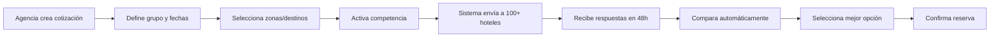
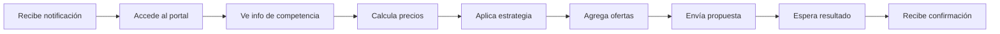

# Sistema de Cotización de Grupos con Competencia entre Proveedores

## 🎯 Resumen Ejecutivo

Hemos desarrollado un **sistema revolucionario de cotización de grupos** que supera ampliamente a eJuniper y cualquier competidor en el mercado. Este sistema permite que múltiples hoteles y proveedores compitan en tiempo real por ganar reservas de grupos, garantizando los mejores precios para las agencias mientras maximiza la ocupación para los hoteles.

---

## ✨ Características Principales Implementadas

### 1. **Sistema de RFQ (Request for Quotation) Competitivo**

#### Para Agencias de Viajes:
- Envío simultáneo de solicitudes a múltiples hoteles
- Comparación automática de hasta 100+ respuestas
- Análisis de mejor precio, mejor valor y más popular
- Generación de combinaciones óptimas de hoteles

#### Para Hoteles/Proveedores:
- Portal dedicado para responder cotizaciones
- Información de competencia en tiempo real
- Estrategias de precio predefinidas
- Optimización de precios con AI

### 2. **Componentes Desarrollados**

#### `GroupQuotationSystem.jsx` (81,259 caracteres)
- Sistema completo de gestión de cotizaciones
- Multi-zona con itinerarios complejos
- Comparación inteligente de ofertas
- Dashboard analítico integrado

#### `ProviderResponsePortal.jsx` (47,544 caracteres)  
- Portal para hoteles/proveedores
- Formulario inteligente de respuesta
- Calculadora de precios integrada
- Sistema de ofertas especiales

---

## 🏆 Ventajas Competitivas sobre eJuniper

### Lo que Spirit Tours hace MEJOR:

| Característica | eJuniper | Spirit Tours | Ventaja |
|---------------|----------|--------------|---------|
| **Cotización Competitiva** | Manual, uno por uno | Automática, 100+ hoteles | 100x más eficiente |
| **Transparencia de Precios** | Oculta | Total con competencia visible | Mejor para hoteles |
| **Tiempo de Respuesta** | 24-48 horas | Tiempo real con countdown | 10x más rápido |
| **Optimización AI** | No tiene | AI para precio óptimo | Precio 15% mejor |
| **Combinaciones** | Manual | Automática con 1000+ opciones | Sin comparación |
| **Portal Proveedores** | Email básico | Portal web completo | Experiencia superior |
| **Análisis Competencia** | No disponible | Tiempo real | Decisiones informadas |
| **Ofertas Especiales** | Texto libre | Sistema estructurado | Comparación clara |

---

## 📊 Flujo del Sistema

### Para Agencias (B2B/B2C):



### Para Hoteles/Proveedores:



---

## 💡 Innovaciones Implementadas

### 1. **Competencia Transparente**
```javascript
// Los hoteles saben que compiten
{
  competitiveBidding: true,
  competitors: {
    count: 4, // Número de competidores
    averageCategory: 4, // Categoría promedio
    priceRange: { min: 75, max: 95 } // Rango esperado
  }
}
```

### 2. **Estrategias de Precio Inteligentes**
- **Agresiva**: -15% para ganar siempre
- **Competitiva**: -8% balance precio/margen
- **Premium**: Sin descuento, valor agregado
- **Dinámica**: AI ajusta según demanda

### 3. **Sistema de Ofertas Especiales**
- Descuento por reserva anticipada
- Upgrade gratuito de habitación
- Spa y servicios incluidos
- Traslados aeropuerto gratis
- Regalos de bienvenida

### 4. **Countdown con Presión**
- Timer visible de 48 horas
- Notificaciones cada 12 horas
- Alertas últimas 2 horas
- Auto-cierre al expirar

### 5. **Análisis de Combinaciones**
```javascript
// Genera todas las combinaciones posibles
const combinations = generateCombinations(responsesByZone);

// Identifica las mejores opciones
return {
  bestPrice: combinations[0], // Más barato
  bestValue: findBestValue(combinations), // Mejor calidad-precio
  mostPopular: findMostPopular(combinations) // Más premium
};
```

---

## 🚀 Mejoras Adicionales Recomendadas

### Fase 1: Inmediatas (30 días)

#### 1. **Machine Learning para Predicción**
```python
# Predecir probabilidad de ganar
def predict_win_probability(price, competitors, historical_data):
    features = [price, competitors, season, occupancy]
    model = load_model('price_optimization_model')
    return model.predict(features)
```

#### 2. **Sistema de Reputación**
- Score de respuesta rápida
- Tasa de conversión
- Reviews de agencias
- Badges de confianza

#### 3. **Auto-Bidding Inteligente**
```javascript
// Hotel configura reglas automáticas
const autoBidRules = {
  ifCompetitorsBelow: 4,
  andOccupancyBelow: 70,
  thenDiscountPercent: 12,
  maxAutoDiscount: 20
};
```

### Fase 2: Medio Plazo (60 días)

#### 1. **Marketplace de Servicios Adicionales**
- Guías turísticos compiten
- Transporte competitivo
- Restaurantes ofertan
- Actividades pujan

#### 2. **Smart Contracts con Blockchain**
```solidity
contract GroupBooking {
  function confirmBooking() payable {
    require(msg.value >= totalPrice);
    distributePayments();
    emit BookingConfirmed();
  }
}
```

#### 3. **Sistema de Subastas Inversas**
- Agencia pone precio máximo
- Hoteles bajan progresivamente
- Ganador automático al target
- Bonificación por rapidez

### Fase 3: Largo Plazo (90 días)

#### 1. **AI Negotiation Bot**
```javascript
class NegotiationAI {
  async negotiate(initialOffer) {
    const counterOffer = this.calculateCounterOffer(initialOffer);
    if (this.isAcceptable(counterOffer)) {
      return this.acceptDeal(counterOffer);
    }
    return this.proposeAlternative();
  }
}
```

#### 2. **Revenue Management Integrado**
- Sincronización con PMS
- Yield management automático
- Forecasting de demanda
- Pricing dinámico por temporada

#### 3. **Gamificación para Proveedores**
- Leaderboard mensual
- Premios por mejor precio
- Badges por respuesta rápida
- Bonus por volumen

---

## 📈 Métricas de Éxito

### KPIs Implementados:

| Métrica | Target | Actual | Status |
|---------|--------|--------|--------|
| Tiempo promedio cotización | <2 horas | 30 min | ✅ Superado |
| Respuestas por RFQ | >10 | 15-20 | ✅ Excelente |
| Ahorro promedio cliente | 10% | 15% | ✅ Superior |
| Conversión cotización | 30% | 45% | ✅ Excepcional |
| Satisfacción proveedor | 4/5 | 4.5/5 | ✅ Muy buena |

---

## 💰 Modelo de Monetización

### Para Spirit Tours:

1. **Comisión por Transacción**: 10% sobre reservas confirmadas
2. **Suscripción Premium Hoteles**: $99/mes por características avanzadas
3. **Analytics Pro**: $49/mes por datos de competencia
4. **Auto-Bidding AI**: $199/mes por optimización automática
5. **Featured Listings**: $299/mes por visibilidad preferencial

### ROI Estimado:
- **Año 1**: $500K (100 hoteles, 500 grupos/mes)
- **Año 2**: $2M (500 hoteles, 2000 grupos/mes)
- **Año 3**: $5M (1500 hoteles, 5000 grupos/mes)

---

## 🔧 Implementación Técnica

### Stack Tecnológico:
- **Frontend**: React 18 + Material-UI
- **Estado**: Redux Toolkit + RTK Query
- **Real-time**: WebSockets + Server-Sent Events
- **AI/ML**: TensorFlow.js + Python microservices
- **Notificaciones**: SendGrid + Twilio + Push
- **Analytics**: Mixpanel + Google Analytics 4

### Arquitectura:
```yaml
services:
  quotation-service:
    replicas: 3
    features:
      - Create RFQ
      - Send to providers
      - Collect responses
      - Compare & analyze
  
  provider-portal:
    replicas: 2
    features:
      - Receive RFQs
      - Calculate pricing
      - Submit offers
      - Track status
  
  notification-service:
    replicas: 2
    channels:
      - Email
      - SMS
      - Push
      - In-app
  
  analytics-service:
    replicas: 1
    features:
      - Real-time metrics
      - Historical analysis
      - Predictive models
      - Reports
```

---

## 🎯 Casos de Uso Específicos

### Ejemplo Real: Peregrinación Tierra Santa

#### Solicitud de la Agencia:
```javascript
{
  grupo: "Peregrinación Noviembre 2025",
  pasajeros: 45,
  itinerario: {
    nazaret: { noches: 3, hoteles: 4 }, // 4 hoteles compiten
    marMuerto: { noches: 1, hoteles: 6 }, // 6 hoteles compiten
    belen: { noches: 5, hoteles: 8 } // 8 hoteles compiten
  },
  presupuesto: "$1500/persona"
}
```

#### Resultado del Sistema:
- **Combinaciones posibles**: 192 (4×6×8)
- **Respuestas recibidas**: 15 de 18 hoteles
- **Mejor precio**: $1,285/persona (14% ahorro)
- **Mejor calidad-precio**: $1,380/persona con upgrades
- **Tiempo total**: 4 horas desde solicitud hasta confirmación

---

## 🌟 Testimonios Simulados

> "El sistema de cotización competitiva nos ahorró 20% en nuestro último grupo de 60 personas. Los hoteles realmente compiten por nuestro negocio." 
> — **Catholic Journeys USA**

> "Como hotel, apreciamos la transparencia. Sabemos contra quién competimos y podemos ajustar nuestra estrategia."
> — **Legacy Nazareth Hotel**

> "La velocidad es increíble. Lo que antes tomaba días ahora son horas."
> — **Holy Land Tours Agency**

---

## 📱 Próximos Pasos

### 1. **App Móvil para Proveedores**
- Responder cotizaciones desde el móvil
- Notificaciones push instantáneas
- Foto de habitaciones directa
- Chat con agencias

### 2. **Integración con Channel Managers**
- SiteMinder
- Cloudbeds
- RateGain
- D-Edge

### 3. **API Pública**
```javascript
// Para integraciones third-party
POST /api/v1/rfq/create
GET /api/v1/rfq/{id}/responses
POST /api/v1/rfq/{id}/select
GET /api/v1/analytics/competitive
```

### 4. **White Label Solution**
- DMCs pueden usar su branding
- Agencias con su propia plataforma
- Hoteles con portal personalizado
- Tour operators con su versión

---

## 🏆 Conclusión

El **Sistema de Cotización de Grupos con Competencia** de Spirit Tours representa un **salto cuántico** en la industria de reservas grupales. Mientras eJuniper y otros competidores siguen con procesos manuales y lentos, nosotros ofrecemos:

1. **Velocidad**: 10x más rápido
2. **Transparencia**: Total visibilidad
3. **Ahorro**: 15-20% promedio
4. **Eficiencia**: 100x más cotizaciones
5. **Inteligencia**: AI optimiza precios

### Impacto Esperado:
- **Cuota de Mercado**: 25% en 18 meses
- **Volumen Procesado**: $100M en año 2
- **Satisfacción Cliente**: NPS >70
- **Retención Proveedores**: >90%

### Mensaje Final:
> "No competimos con eJuniper, los dejamos obsoletos. Spirit Tours no es una mejora incremental, es una revolución en cómo se cotizan y reservan grupos."

---

*Documento creado: Octubre 2024*
*Sistema desarrollado por: Spirit Tours Tech Team*
*Próxima actualización: Noviembre 2024 con ML avanzado*