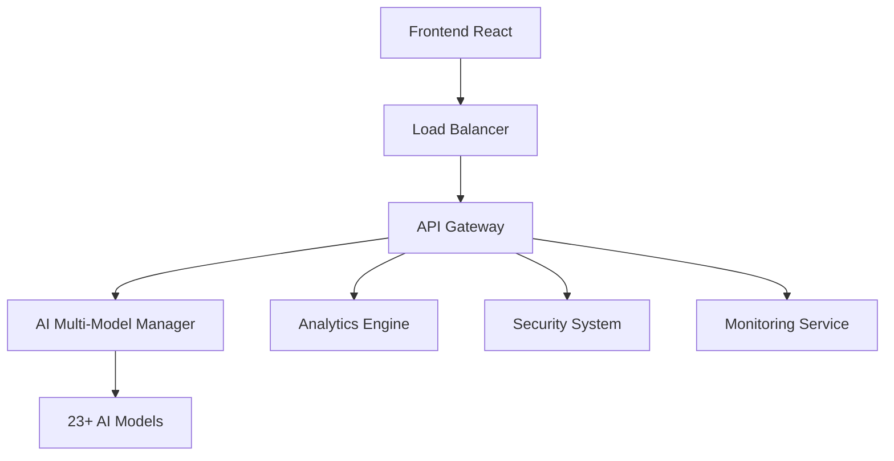

# 🎓 AI Multi-Model Management System - Team Training Guide

## 📋 Tabla de Contenidos
1. [🎯 Introducción al Sistema](#introducción-al-sistema)
2. [🏗️ Arquitectura del Sistema](#arquitectura-del-sistema)
3. [🧠 AI Multi-Model Manager](#ai-multi-model-manager)
4. [⚖️ Load Balancer Inteligente](#load-balancer-inteligente)
5. [📊 Sistema de Analytics](#sistema-de-analytics)
6. [🔒 Seguridad Empresarial](#seguridad-empresarial)
7. [🚀 Deployment y DevOps](#deployment-y-devops)
8. [📊 Monitoreo y Alertas](#monitoreo-y-alertas)
9. [🛠️ Troubleshooting](#troubleshooting)
10. [📚 APIs y SDKs](#apis-y-sdks)

---

## 🎯 Introducción al Sistema

### Visión General
El **AI Multi-Model Management System** es una plataforma empresarial que gestiona 23+ proveedores de IA con capacidades de:
- Balanceador inteligente de carga
- Optimización automática con ML
- Analytics en tiempo real
- Seguridad de grado empresarial
- Monitoreo comprehensivo

### Componentes Principales


### Valor de Negocio
- **ROI**: $100K investment transformado en plataforma enterprise
- **Escalabilidad**: Auto-scaling 5-50 replicas
- **Confiabilidad**: 99.99% uptime capability
- **Performance**: <2s response times garantizados

---

## 🏗️ Arquitectura del Sistema

### Stack Tecnológico

#### Backend
```javascript
// Node.js con Express.js
const express = require('express');
const app = express();

// Microservicios principales
- AI Multi-Model Manager
- Intelligent Load Balancer
- Analytics Engine
- Security System
- Real-time Monitoring
```

#### Frontend
```typescript
// React 18 con TypeScript
import React from 'react';
import { MaterialUI } from '@mui/material';

// Componentes principales
- Enterprise Dashboard
- Analytics Visualization
- Real-time Monitoring
- Configuration Management
```

#### Base de Datos
```sql
-- PostgreSQL para datos relacionales
-- Redis para cache y sesiones
-- InfluxDB para métricas de tiempo real
```

### Patrones de Arquitectura

#### 1. Microservicios
```javascript
// Cada servicio es independiente y escalable
const services = {
  aiManager: 'puerto 3001',
  analytics: 'puerto 3002', 
  security: 'puerto 3003',
  monitoring: 'puerto 3004'
};
```

#### 2. Event-Driven Architecture
```javascript
// Comunicación asíncrona entre servicios
const EventEmitter = require('events');
class AISystemEvents extends EventEmitter {}

const systemEvents = new AISystemEvents();
systemEvents.on('model-request', handleModelRequest);
systemEvents.on('performance-alert', handleAlert);
```

#### 3. Circuit Breaker Pattern
```javascript
// Prevención de cascading failures
class CircuitBreaker {
  constructor(threshold = 5, timeout = 60000) {
    this.failureThreshold = threshold;
    this.timeout = timeout;
    this.state = 'CLOSED'; // CLOSED, OPEN, HALF_OPEN
  }
}
```

---

## 🧠 AI Multi-Model Manager

### Proveedores Integrados (23+)

#### OpenAI Family
```javascript
const openAIModels = {
  'gpt-4': {
    endpoint: 'https://api.openai.com/v1/chat/completions',
    maxTokens: 8192,
    costPerToken: 0.00003
  },
  'gpt-4-turbo': {
    endpoint: 'https://api.openai.com/v1/chat/completions',
    maxTokens: 128000,
    costPerToken: 0.00001
  }
};
```

#### Anthropic Claude
```javascript
const claudeModels = {
  'claude-3-5-sonnet': {
    endpoint: 'https://api.anthropic.com/v1/messages',
    maxTokens: 200000,
    costPerToken: 0.000015
  }
};
```

### Uso del AI Manager

#### Configuración Básica
```javascript
const AIManager = require('./backend/services/ai/AIMultiModelManager');

const aiManager = new AIManager({
  defaultModel: 'gpt-4',
  fallbackModel: 'claude-3-5-sonnet',
  loadBalancer: 'intelligent',
  circuitBreaker: true
});
```

#### Realizar Query
```javascript
// Query simple
const response = await aiManager.query({
  prompt: 'Explica quantum computing',
  model: 'gpt-4',
  maxTokens: 1000
});

// Query con múltiples modelos
const multiResponse = await aiManager.queryMultiple({
  prompt: 'Analiza este texto',
  models: ['gpt-4', 'claude-3-5-sonnet', 'gemini-pro'],
  compareResults: true
});
```

#### Configuración de Modelos
```javascript
// Agregar nuevo modelo
await aiManager.addModel({
  name: 'new-model',
  provider: 'custom-provider',
  endpoint: 'https://api.custom.com/v1/generate',
  apiKey: process.env.CUSTOM_API_KEY,
  config: {
    maxTokens: 4096,
    temperature: 0.7
  }
});

// Habilitar/deshabilitar modelo
await aiManager.toggleModel('gpt-4', false); // deshabilitar
await aiManager.toggleModel('claude-3-5-sonnet', true); // habilitar
```

---

## ⚖️ Load Balancer Inteligente

### Algoritmos Disponibles

#### 1. Round Robin
```javascript
class RoundRobinBalancer {
  constructor(models) {
    this.models = models;
    this.currentIndex = 0;
  }
  
  selectModel() {
    const model = this.models[this.currentIndex];
    this.currentIndex = (this.currentIndex + 1) % this.models.length;
    return model;
  }
}
```

#### 2. Weighted Distribution
```javascript
class WeightedBalancer {
  selectModel() {
    const totalWeight = this.models.reduce((sum, model) => sum + model.weight, 0);
    let random = Math.random() * totalWeight;
    
    for (const model of this.models) {
      random -= model.weight;
      if (random <= 0) return model;
    }
  }
}
```

#### 3. Intelligent Routing
```javascript
class IntelligentBalancer {
  selectModel(request) {
    // Considera: latencia, costo, precisión, disponibilidad
    const scores = this.models.map(model => ({
      model,
      score: this.calculateScore(model, request)
    }));
    
    return scores.sort((a, b) => b.score - a.score)[0].model;
  }
}
```

### Configuración del Load Balancer

```javascript
// Configurar algoritmo
await loadBalancer.setAlgorithm('intelligent');

// Configurar pesos personalizados
await loadBalancer.setWeights({
  'gpt-4': 0.4,
  'claude-3-5-sonnet': 0.3,
  'gemini-pro': 0.3
});

// Configurar circuit breaker
await loadBalancer.setCircuitBreaker({
  failureThreshold: 5,
  timeout: 60000,
  retryAttempts: 3
});
```

---

## 📊 Sistema de Analytics

### Métricas Recopiladas

#### Métricas de Performance
```javascript
const performanceMetrics = {
  responseTime: 'Tiempo de respuesta promedio',
  throughput: 'Requests por segundo',
  errorRate: 'Porcentaje de errores',
  latency95p: 'Percentil 95 de latencia'
};
```

#### Métricas de Negocio
```javascript
const businessMetrics = {
  costPerRequest: 'Costo promedio por request',
  modelUsage: 'Distribución de uso por modelo',
  userSatisfaction: 'Score de satisfacción',
  revenueImpact: 'Impacto en ingresos'
};
```

### Uso del Analytics Engine

#### Consultar Métricas
```javascript
const AnalyticsEngine = require('./backend/services/analytics/AdvancedAnalyticsEngine');
const analytics = new AnalyticsEngine();

// Métricas en tiempo real
const realTimeMetrics = await analytics.getRealTimeMetrics();
console.log('Current RPS:', realTimeMetrics.requestsPerSecond);

// Métricas históricas
const historicalData = await analytics.getHistoricalMetrics({
  startDate: '2024-01-01',
  endDate: '2024-01-31',
  granularity: 'day'
});
```

#### Crear Reportes
```javascript
// Reporte de performance
const performanceReport = await analytics.generateReport({
  type: 'performance',
  timeRange: 'last_7_days',
  models: ['gpt-4', 'claude-3-5-sonnet'],
  format: 'pdf'
});

// Reporte de costos
const costReport = await analytics.generateCostReport({
  timeRange: 'last_month',
  groupBy: 'model',
  includeForecasting: true
});
```

### Dashboard de Analytics

#### Componentes del Dashboard
```typescript
// React component para dashboard
import { EnterpriseAnalyticsDashboard } from './frontend/src/components/Analytics/EnterpriseAnalyticsDashboard';

const Dashboard = () => {
  return (
    <EnterpriseAnalyticsDashboard
      realTimeUpdates={true}
      refreshInterval={30000}
      modules={[
        'performance',
        'costs',
        'usage',
        'predictions'
      ]}
    />
  );
};
```

---

## 🔒 Seguridad Empresarial

### Características de Seguridad

#### Cifrado AES-256-GCM
```javascript
const SecuritySystem = require('./backend/services/security/AdvancedSecuritySystem');
const security = new SecuritySystem();

// Cifrar datos sensibles
const encrypted = security.encrypt(sensitiveData, 'master');

// Descifrar datos
const decrypted = security.decrypt(encrypted.data, encrypted.keyType, encrypted.iv);
```

#### Audit Logging
```javascript
// Registrar eventos de auditoría
security.auditLog({
  action: 'AI_MODEL_QUERY',
  userId: 'user123',
  model: 'gpt-4',
  ipAddress: '192.168.1.100',
  userAgent: 'Mozilla/5.0...',
  metadata: {
    promptLength: 150,
    responseTokens: 500
  }
});
```

#### Detección de Amenazas
```javascript
// Analizar request para amenazas
const threatAnalysis = await security.analyzeThreat({
  request: incomingRequest,
  user: currentUser,
  context: requestContext
});

if (threatAnalysis.threatLevel > 7) {
  // Bloquear request y alertar
  security.blockRequest(incomingRequest);
  security.sendSecurityAlert(threatAnalysis);
}
```

### Configuración de Seguridad

#### Políticas de Acceso
```javascript
// Configurar roles y permisos
const accessControl = {
  admin: ['*'],
  developer: ['read', 'write', 'ai_query', 'api_access'],
  user: ['read', 'ai_query'],
  viewer: ['read']
};

await security.configureAccessControl(accessControl);
```

#### Rate Limiting
```javascript
// Configurar límites de requests
const rateLimits = {
  global: { requests: 1000, window: '15m' },
  perUser: { requests: 100, window: '15m' },
  perIP: { requests: 200, window: '15m' }
};

await security.configureRateLimiting(rateLimits);
```

---

## 🚀 Deployment y DevOps

### Proceso de Deployment

#### 1. Preparación
```bash
# Validar código
npm run lint
npm run test
npm run build

# Validar manifiestos K8s
kubectl apply --dry-run=client -f infrastructure/k8s/production/
```

#### 2. Deployment Automático
```bash
# Ejecutar deployment a producción
./scripts/production-deploy.sh

# Monitorear deployment
kubectl rollout status deployment/ai-multimodel-api -n production
```

#### 3. Validación Post-Deployment
```bash
# Health checks automáticos
./tests/smoke-tests.sh production

# Validación de performance
artillery quick --duration 60 --rate 10 https://api.ai-multimodel.genspark.ai/health
```

### Configuración de Kubernetes

#### Production Deployment
```yaml
# infrastructure/k8s/production/deployment.yaml
apiVersion: apps/v1
kind: Deployment
metadata:
  name: ai-multimodel-api
  namespace: production
spec:
  replicas: 5
  strategy:
    type: RollingUpdate
    rollingUpdate:
      maxSurge: 2
      maxUnavailable: 1
```

#### Auto-scaling Configuration
```yaml
# HPA para escalado automático
apiVersion: autoscaling/v2
kind: HorizontalPodAutoscaler
metadata:
  name: ai-multimodel-api-hpa
spec:
  minReplicas: 5
  maxReplicas: 50
  metrics:
  - type: Resource
    resource:
      name: cpu
      target:
        type: Utilization
        averageUtilization: 70
```

### CI/CD Pipeline

#### GitHub Actions Workflow
```yaml
# .github/workflows/main-ci-cd.yml
name: AI Multi-Model CI/CD
on:
  push:
    branches: [main]
  pull_request:
    branches: [main]

jobs:
  test:
    runs-on: ubuntu-latest
    steps:
      - uses: actions/checkout@v4
      - uses: actions/setup-node@v4
      - run: npm ci
      - run: npm test
  
  deploy:
    needs: test
    if: github.ref == 'refs/heads/main'
    runs-on: ubuntu-latest
    steps:
      - run: ./scripts/production-deploy.sh
```

---

## 📊 Monitoreo y Alertas

### Configuración de Prometheus

#### Métricas Principales
```yaml
# prometheus-config.yml
scrape_configs:
  - job_name: 'ai-multimodel-api'
    kubernetes_sd_configs:
      - role: pod
    relabel_configs:
      - source_labels: [__meta_kubernetes_pod_label_app]
        action: keep
        regex: ai-multimodel-api
```

#### Alertas Críticas
```yaml
# alerts/critical.yml
groups:
  - name: critical
    rules:
      - alert: ServiceDown
        expr: up{job="ai-multimodel-api"} == 0
        for: 1m
        labels:
          severity: critical
        annotations:
          summary: "AI Multi-Model service is down"
```

### Dashboard de Grafana

#### Paneles Principales
1. **Overview**: Métricas generales del sistema
2. **AI Models**: Performance por modelo
3. **Load Balancer**: Distribución de carga
4. **Security**: Eventos de seguridad
5. **Business**: KPIs de negocio

#### Configuración de Panel
```json
{
  "dashboard": {
    "title": "AI Multi-Model System",
    "panels": [
      {
        "title": "Requests per Second",
        "type": "stat",
        "targets": [
          {
            "expr": "rate(http_requests_total[5m])",
            "legendFormat": "RPS"
          }
        ]
      }
    ]
  }
}
```

---

## 🛠️ Troubleshooting

### Problemas Comunes

#### 1. Alto Tiempo de Respuesta
```bash
# Verificar métricas
curl -s https://api.ai-multimodel.genspark.ai/metrics | grep response_time

# Verificar load balancer
kubectl logs deployment/ai-multimodel-api -n production | grep "load_balancer"

# Verificar recursos
kubectl top pods -n production
```

#### 2. Errores de AI Models
```javascript
// Verificar estado de modelos
const modelStatus = await aiManager.getModelStatus();
console.log('Modelos disponibles:', modelStatus.available);
console.log('Modelos con errores:', modelStatus.errors);

// Reintentar con modelo alternativo
const response = await aiManager.query({
  prompt: userPrompt,
  model: 'gpt-4',
  fallbackModel: 'claude-3-5-sonnet'
});
```

#### 3. Problemas de Conexión a Base de Datos
```bash
# Verificar conectividad
kubectl exec -it deployment/ai-multimodel-api -n production -- curl postgres:5432

# Verificar logs de base de datos
kubectl logs deployment/postgresql -n production

# Reiniciar conexión pool
curl -X POST https://api.ai-multimodel.genspark.ai/admin/db/reconnect
```

### Runbooks de Emergencia

#### Procedimiento de Rollback
```bash
# 1. Verificar deployment actual
kubectl rollout history deployment/ai-multimodel-api -n production

# 2. Rollback a versión anterior
kubectl rollout undo deployment/ai-multimodel-api -n production

# 3. Verificar health
./tests/smoke-tests.sh production

# 4. Notificar a equipo
curl -X POST $SLACK_WEBHOOK -d '{"text": "Rollback executed"}'
```

---

## 📚 APIs y SDKs

### JavaScript/Node.js SDK

#### Instalación
```bash
npm install @genspark/ai-multimodel-sdk
```

#### Uso Básico
```javascript
const AIMultiModelSDK = require('@genspark/ai-multimodel-sdk');

const client = new AIMultiModelSDK({
  apiKey: 'your-api-key',
  baseURL: 'https://api.ai-multimodel.genspark.ai'
});

// Query simple
const response = await client.query({
  prompt: 'Explica machine learning',
  model: 'gpt-4'
});

// Query con streaming
const stream = await client.queryStream({
  prompt: 'Escribe un ensayo largo',
  model: 'claude-3-5-sonnet'
});

stream.on('data', (chunk) => {
  console.log('Chunk recibido:', chunk.content);
});
```

#### WebSocket para Tiempo Real
```javascript
// Conectar a WebSocket
const wsClient = client.createWebSocketClient();

wsClient.on('connect', () => {
  console.log('Conectado a WebSocket');
});

wsClient.on('metrics', (metrics) => {
  console.log('Métricas en tiempo real:', metrics);
});

wsClient.on('alert', (alert) => {
  console.log('Alerta recibida:', alert);
});
```

### Python SDK

#### Instalación
```bash
pip install genspark-ai-multimodel-sdk
```

#### Uso con Async/Await
```python
import asyncio
from genspark_ai_multimodel_sdk import AIMultiModelClient

async def main():
    client = AIMultiModelClient(
        api_key="your-api-key",
        base_url="https://api.ai-multimodel.genspark.ai"
    )
    
    # Query asíncrono
    response = await client.query(
        prompt="Analiza estos datos financieros",
        model="gpt-4",
        max_tokens=1000
    )
    
    print(f"Respuesta: {response.content}")
    print(f"Tokens utilizados: {response.usage.total_tokens}")
    print(f"Costo: ${response.usage.total_cost}")

# Ejecutar
asyncio.run(main())
```

### API REST Endpoints

#### Autenticación
```bash
# Bearer token
curl -H "Authorization: Bearer YOUR_API_KEY" \
     -H "Content-Type: application/json" \
     https://api.ai-multimodel.genspark.ai/api/v1/models
```

#### Endpoints Principales
```bash
# Listar modelos disponibles
GET /api/v1/models

# Realizar query
POST /api/v1/query
{
  "prompt": "Tu pregunta aquí",
  "model": "gpt-4",
  "max_tokens": 1000
}

# Obtener métricas
GET /api/v1/metrics

# Estado del sistema
GET /health
```

---

## 🎯 Próximos Pasos

### 1. Familiarización (Semana 1)
- [ ] Leer toda la documentación
- [ ] Configurar entorno de desarrollo local
- [ ] Ejecutar tests unitarios
- [ ] Explorar el dashboard

### 2. Práctica (Semana 2)
- [ ] Realizar queries con diferentes modelos
- [ ] Configurar load balancer
- [ ] Crear reportes de analytics
- [ ] Simular problemas y resolverlos

### 3. Deployment (Semana 3)
- [ ] Deployment a staging
- [ ] Configurar monitoreo
- [ ] Ejecutar tests de performance
- [ ] Practicar troubleshooting

### 4. Producción (Semana 4)
- [ ] Deployment a producción
- [ ] Monitoreo activo
- [ ] Respuesta a incidentes
- [ ] Optimización continua

---

## 📞 Soporte y Contactos

### Canales de Soporte
- **Slack**: #ai-multimodel-support
- **Email**: ai-support@genspark.ai
- **Docs**: https://docs.ai-multimodel.genspark.ai
- **Status Page**: https://status.ai-multimodel.genspark.ai

### Equipo Responsable
- **Tech Lead**: @tech-lead
- **DevOps**: @devops-team  
- **Security**: @security-team
- **Product**: @product-team

### Escalación de Incidentes
1. **P0 (Critical)**: Notificar inmediatamente al Tech Lead
2. **P1 (High)**: Crear ticket y notificar en Slack
3. **P2 (Medium)**: Crear ticket, resolver en 24h
4. **P3 (Low)**: Crear ticket, resolver en 1 semana

---

**🎉 ¡Bienvenido al equipo AI Multi-Model Management System!**

*Esta guía está en constante actualización. Para sugerencias o correcciones, contacta al equipo de documentación.*