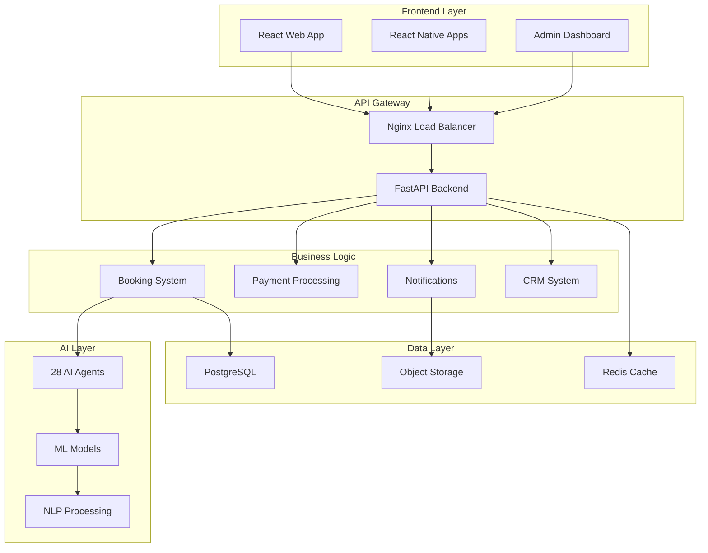

# 📚 Spirit Tours - Programa Completo de Capacitación del Equipo

## 🎯 Objetivo del Programa

Proporcionar al equipo de Spirit Tours el conocimiento y habilidades necesarias para operar, mantener y evolucionar la plataforma empresarial de reservas con 28 agentes IA.

---

## 📋 Índice de Contenidos

1. [Visión General del Sistema](#1-visión-general-del-sistema)
2. [Módulos de Capacitación](#2-módulos-de-capacitación)
3. [Rutas de Aprendizaje por Rol](#3-rutas-de-aprendizaje-por-rol)
4. [Recursos y Materiales](#4-recursos-y-materiales)
5. [Evaluaciones y Certificación](#5-evaluaciones-y-certificación)
6. [Plan de Implementación](#6-plan-de-implementación)

---

## 1. Visión General del Sistema

### 🏗️ Arquitectura de la Plataforma



### 🔑 Componentes Clave

| Componente | Tecnología | Función |
|------------|------------|---------|
| **Frontend Web** | React 19.1, TypeScript | Interfaz de usuario principal |
| **Mobile Apps** | React Native | Apps iOS/Android |
| **Backend API** | FastAPI, Python 3.11 | Lógica de negocio |
| **Base de Datos** | PostgreSQL 15 | Persistencia de datos |
| **Cache** | Redis 7 | Cache y sesiones |
| **AI Agents** | OpenAI, LangChain | Inteligencia artificial |
| **Message Queue** | RabbitMQ | Procesamiento asíncrono |
| **Monitoring** | Prometheus, Grafana | Observabilidad |

---

## 2. Módulos de Capacitación

### 📦 Módulo 1: Fundamentos del Sistema (8 horas)

#### Sesión 1.1: Introducción a la Plataforma (2h)
- **Objetivos de Aprendizaje:**
  - Comprender la visión y misión del sistema
  - Identificar los componentes principales
  - Navegar por la arquitectura
  
- **Contenido:**
  ```markdown
  1. Historia y evolución del proyecto
  2. Objetivos de negocio
  3. Arquitectura de microservicios
  4. Modelos de negocio: B2C, B2B, B2B2C
  5. Integración de 28 agentes IA
  ```

- **Ejercicios Prácticos:**
  - Tour guiado por la plataforma
  - Identificación de flujos de negocio
  - Mapping de componentes técnicos

#### Sesión 1.2: Navegación y UI/UX (2h)
- **Contenido:**
  - Diseño de interfaces
  - Flujos de usuario
  - Responsive design
  - Accesibilidad

#### Sesión 1.3: Seguridad y Compliance (2h)
- **Contenido:**
  - Autenticación JWT + 2FA
  - RBAC (44 roles)
  - GDPR compliance
  - PCI DSS para pagos

#### Sesión 1.4: Ecosistema de Integraciones (2h)
- **Contenido:**
  - APIs REST
  - Webhooks
  - Integraciones OTA
  - PBX 3CX

### 📦 Módulo 2: Operaciones del Sistema (12 horas)

#### Sesión 2.1: Gestión de Reservas (3h)
```python
# Ejemplo de código para crear reserva
async def create_booking(booking_data: BookingCreate):
    """
    Proceso de creación de reserva:
    1. Validar disponibilidad
    2. Calcular precios
    3. Aplicar descuentos
    4. Crear registro
    5. Enviar confirmación
    """
    # Validación
    tour = await validate_tour_availability(booking_data.tour_id)
    
    # Cálculo de precio
    price = calculate_booking_price(
        tour=tour,
        guests=booking_data.guests,
        date=booking_data.date
    )
    
    # Aplicar reglas de negocio
    if booking_data.channel == "b2b":
        price = apply_b2b_commission(price)
    
    # Crear reserva
    booking = await BookingService.create(booking_data, price)
    
    # Notificar
    await NotificationService.send_confirmation(booking)
    
    return booking
```

**Laboratorio Práctico:**
- Crear reservas multicanal
- Gestionar modificaciones
- Procesar cancelaciones
- Manejar reembolsos

#### Sesión 2.2: Sistema de Pagos (3h)
- **Procesadores Soportados:**
  - Stripe
  - PayPal
  - Redsys
  
- **Flujos de Pago:**
  ```javascript
  // Frontend - Proceso de pago
  const processPayment = async (bookingId, paymentMethod) => {
    try {
      // 1. Crear intención de pago
      const intent = await api.createPaymentIntent({
        booking_id: bookingId,
        method: paymentMethod
      });
      
      // 2. Confirmar con procesador
      const result = await stripe.confirmPayment({
        clientSecret: intent.client_secret,
        confirmParams: {
          return_url: `${window.location.origin}/payment/success`
        }
      });
      
      // 3. Manejar resultado
      if (result.error) {
        handlePaymentError(result.error);
      } else {
        handlePaymentSuccess(result.paymentIntent);
      }
    } catch (error) {
      console.error('Payment failed:', error);
    }
  };
  ```

#### Sesión 2.3: Gestión de Clientes y CRM (3h)
- **Funcionalidades CRM:**
  - Perfiles de cliente 360°
  - Historial de interacciones
  - Segmentación automática
  - Campañas personalizadas

#### Sesión 2.4: Reporting y Analytics (3h)
- **Dashboards Disponibles:**
  - Executive Dashboard
  - Operations Dashboard
  - Financial Dashboard
  - AI Performance Dashboard

### 📦 Módulo 3: Inteligencia Artificial (16 horas)

#### Sesión 3.1: Introducción a los 28 Agentes IA (4h)

**Track 1 - Customer & Revenue Excellence (10 agentes):**

| Agente | Función | Uso Práctico |
|--------|---------|--------------|
| MultiChannelAgent | Unifica canales | Consolidar leads de todos los canales |
| ContentMasterAgent | Genera contenido | Crear descripciones de tours |
| CompetitiveIntelAgent | Análisis competencia | Monitorear precios competidores |
| CustomerProphetAgent | Predicción comportamiento | Anticipar abandonos |
| ExperienceCuratorAgent | Personalización | Recomendar tours |
| RevenueMaximizerAgent | Optimización precios | Ajustar tarifas dinámicamente |
| SocialSentimentAgent | Análisis sentimientos | Monitorear redes sociales |
| BookingOptimizerAgent | Optimizar conversiones | Mejorar funnel de ventas |
| DemandForecasterAgent | Pronóstico demanda | Planificar capacidad |
| FeedbackAnalyzerAgent | Análisis feedback | Procesar reviews |

**Track 2 - Security & Market Intelligence (5 agentes):**

| Agente | Función | Uso Práctico |
|--------|---------|--------------|
| SecurityGuardAgent | Seguridad | Detectar fraudes |
| MarketEntryAgent | Expansión mercados | Identificar oportunidades |
| InfluencerMatchAgent | Marketing influencers | Encontrar embajadores |
| LuxuryUpsellAgent | Upselling premium | Maximizar ticket promedio |
| RouteGeniusAgent | Optimización rutas | Planificar itinerarios |

**Track 3 - Ethics & Sustainability (13 agentes):**

| Agente | Función | Uso Práctico |
|--------|---------|--------------|
| CrisisManagementAgent | Gestión crisis | Responder emergencias |
| PersonalizationEngineAgent | Personalización ML | Adaptar experiencias |
| CulturalAdaptationAgent | Adaptación cultural | Localizar contenido |
| SustainabilityAdvisorAgent | Sostenibilidad | Recomendar eco-tours |
| KnowledgeCuratorAgent | Gestión conocimiento | Organizar información |
| WellnessOptimizerAgent | Bienestar | Tours de salud |
| AccessibilitySpecialistAgent | Accesibilidad | Tours inclusivos |
| CarbonOptimizerAgent | Huella carbono | Calcular emisiones |
| LocalImpactAnalyzerAgent | Impacto local | Evaluar beneficios |
| EthicalTourismAdvisorAgent | Turismo ético | Promover prácticas responsables |
| VirtualTourAgent | Tours virtuales | Experiencias digitales |
| EmergencyResponseAgent | Respuesta emergencias | Protocolo crisis |
| RegulationComplianceAgent | Compliance | Cumplimiento normativo |

#### Sesión 3.2: Uso Práctico de Agentes IA (4h)

```python
# Ejemplo: Usar agente de personalización
from ai_agents import PersonalizationEngineAgent

async def get_personalized_recommendations(user_id: str):
    """
    Obtener recomendaciones personalizadas usando IA
    """
    # Inicializar agente
    agent = PersonalizationEngineAgent()
    
    # Obtener contexto del usuario
    user_context = await get_user_context(user_id)
    
    # Generar recomendaciones
    recommendations = await agent.generate_recommendations(
        user_preferences=user_context.preferences,
        past_bookings=user_context.booking_history,
        browsing_behavior=user_context.browsing_data,
        budget_range=user_context.budget,
        travel_dates=user_context.planned_dates
    )
    
    # Rankear por relevancia
    ranked_recommendations = agent.rank_by_relevance(
        recommendations,
        user_context
    )
    
    return ranked_recommendations[:10]  # Top 10
```

#### Sesión 3.3: Entrenamiento y Ajuste de Modelos (4h)
- Fine-tuning de modelos
- Evaluación de performance
- A/B testing de IA
- Métricas de éxito

#### Sesión 3.4: Casos de Uso Avanzados (4h)
- Automatización de workflows
- Chatbots inteligentes
- Análisis predictivo
- Optimización de rutas

### 📦 Módulo 4: Desarrollo y Personalización (20 horas)

#### Sesión 4.1: Entorno de Desarrollo (4h)

**Setup del Entorno:**
```bash
# 1. Clonar repositorio
git clone https://github.com/spirit-tours/platform.git
cd platform

# 2. Instalar dependencias backend
cd backend
python -m venv venv
source venv/bin/activate  # Linux/Mac
# o
venv\Scripts\activate  # Windows
pip install -r requirements.txt

# 3. Instalar dependencias frontend
cd ../frontend
npm install

# 4. Configurar variables de entorno
cp .env.example .env
# Editar .env con credenciales

# 5. Inicializar base de datos
cd ../backend
alembic upgrade head
python init_database.py

# 6. Iniciar servicios
docker-compose up -d  # Servicios auxiliares
python main.py  # Backend
npm run dev  # Frontend (en otra terminal)
```

#### Sesión 4.2: API Development (4h)

**Crear un Nuevo Endpoint:**
```python
# backend/api/custom_endpoint.py
from fastapi import APIRouter, Depends, HTTPException
from sqlalchemy.orm import Session
from typing import List

router = APIRouter(prefix="/api/custom", tags=["custom"])

@router.get("/special-offers")
async def get_special_offers(
    destination: str = None,
    min_discount: float = 0,
    db: Session = Depends(get_db),
    current_user: User = Depends(get_current_user)
):
    """
    Endpoint personalizado para ofertas especiales
    """
    query = db.query(Tour).filter(
        Tour.discount_percentage >= min_discount
    )
    
    if destination:
        query = query.filter(Tour.destination == destination)
    
    offers = query.all()
    
    # Aplicar personalización con IA
    if current_user:
        personalized_offers = await PersonalizationEngine.rank_offers(
            offers, current_user
        )
        return personalized_offers
    
    return offers
```

#### Sesión 4.3: Frontend Components (4h)

**Crear Componente React:**
```typescript
// frontend/src/components/SpecialOffers.tsx
import React, { useState, useEffect } from 'react';
import { Card, Grid, Typography, Chip } from '@mui/material';
import { useApi } from '../hooks/useApi';

interface Offer {
  id: string;
  title: string;
  destination: string;
  originalPrice: number;
  discountedPrice: number;
  discountPercentage: number;
  validUntil: Date;
}

export const SpecialOffers: React.FC = () => {
  const [offers, setOffers] = useState<Offer[]>([]);
  const [loading, setLoading] = useState(true);
  const api = useApi();

  useEffect(() => {
    loadOffers();
  }, []);

  const loadOffers = async () => {
    try {
      const response = await api.get('/custom/special-offers');
      setOffers(response.data);
    } catch (error) {
      console.error('Failed to load offers:', error);
    } finally {
      setLoading(false);
    }
  };

  if (loading) return <div>Loading special offers...</div>;

  return (
    <Grid container spacing={3}>
      {offers.map(offer => (
        <Grid item xs={12} sm={6} md={4} key={offer.id}>
          <Card className="offer-card">
            <Typography variant="h6">{offer.title}</Typography>
            <Typography variant="body2">{offer.destination}</Typography>
            <div className="price-section">
              <Typography className="original-price">
                ${offer.originalPrice}
              </Typography>
              <Typography className="discounted-price">
                ${offer.discountedPrice}
              </Typography>
              <Chip 
                label={`-${offer.discountPercentage}%`}
                color="secondary"
                size="small"
              />
            </div>
            <Typography variant="caption">
              Valid until: {new Date(offer.validUntil).toLocaleDateString()}
            </Typography>
          </Card>
        </Grid>
      ))}
    </Grid>
  );
};
```

#### Sesión 4.4: Testing y QA (4h)

**Tests Unitarios:**
```python
# tests/test_booking_service.py
import pytest
from datetime import datetime, timedelta
from services.booking_service import BookingService

@pytest.fixture
def booking_service():
    return BookingService()

@pytest.fixture
def sample_booking_data():
    return {
        'tour_id': 'tour_001',
        'customer_id': 'cust_123',
        'date': datetime.now() + timedelta(days=7),
        'guests': 2,
        'special_requests': 'Vegetarian meals'
    }

def test_create_booking_success(booking_service, sample_booking_data):
    """Test successful booking creation"""
    booking = booking_service.create_booking(sample_booking_data)
    
    assert booking is not None
    assert booking.status == 'pending_payment'
    assert booking.tour_id == sample_booking_data['tour_id']
    assert booking.total_guests == 2

def test_create_booking_unavailable_date(booking_service, sample_booking_data):
    """Test booking creation with unavailable date"""
    sample_booking_data['date'] = datetime.now() - timedelta(days=1)
    
    with pytest.raises(ValidationError) as exc_info:
        booking_service.create_booking(sample_booking_data)
    
    assert 'past date' in str(exc_info.value).lower()

def test_calculate_booking_price(booking_service):
    """Test price calculation logic"""
    base_price = 100
    guests = 3
    
    # Test regular pricing
    price = booking_service.calculate_price(base_price, guests)
    assert price == 300
    
    # Test group discount (10% for 5+ guests)
    price = booking_service.calculate_price(base_price, 5)
    assert price == 450  # 500 - 10%
```

**Tests de Integración:**
```javascript
// tests/integration/booking-flow.test.js
describe('Complete Booking Flow', () => {
  it('should complete entire booking process', async () => {
    // 1. Search for tours
    const searchResponse = await api.get('/tours/search', {
      params: { destination: 'Madrid' }
    });
    expect(searchResponse.status).toBe(200);
    expect(searchResponse.data.tours).toHaveLength(greaterThan(0));
    
    // 2. Select a tour
    const tour = searchResponse.data.tours[0];
    
    // 3. Create booking
    const bookingResponse = await api.post('/bookings/create', {
      tour_id: tour.id,
      date: '2024-12-15',
      guests: 2
    });
    expect(bookingResponse.status).toBe(201);
    const booking = bookingResponse.data;
    
    // 4. Process payment
    const paymentResponse = await api.post('/payments/process', {
      booking_id: booking.id,
      payment_method: 'card',
      amount: booking.total_price
    });
    expect(paymentResponse.status).toBe(200);
    
    // 5. Verify confirmation
    const confirmationResponse = await api.get(`/bookings/${booking.id}`);
    expect(confirmationResponse.data.status).toBe('confirmed');
  });
});
```

#### Sesión 4.5: Deployment y CI/CD (4h)

**Pipeline de CI/CD:**
```yaml
# .github/workflows/deploy.yml
name: Deploy to Production

on:
  push:
    branches: [main]
  pull_request:
    branches: [main]

jobs:
  test:
    runs-on: ubuntu-latest
    steps:
      - uses: actions/checkout@v3
      
      - name: Setup Python
        uses: actions/setup-python@v4
        with:
          python-version: '3.11'
      
      - name: Install dependencies
        run: |
          pip install -r requirements.txt
          pip install pytest pytest-cov
      
      - name: Run tests
        run: |
          pytest tests/ --cov=. --cov-report=xml
      
      - name: Upload coverage
        uses: codecov/codecov-action@v3

  build:
    needs: test
    runs-on: ubuntu-latest
    steps:
      - uses: actions/checkout@v3
      
      - name: Build Docker images
        run: |
          docker build -t spirit-tours/backend:${{ github.sha }} ./backend
          docker build -t spirit-tours/frontend:${{ github.sha }} ./frontend
      
      - name: Push to registry
        run: |
          echo ${{ secrets.DOCKER_PASSWORD }} | docker login -u ${{ secrets.DOCKER_USERNAME }} --password-stdin
          docker push spirit-tours/backend:${{ github.sha }}
          docker push spirit-tours/frontend:${{ github.sha }}

  deploy:
    needs: build
    runs-on: ubuntu-latest
    if: github.ref == 'refs/heads/main'
    steps:
      - name: Deploy to production
        run: |
          ssh ${{ secrets.PROD_SERVER }} << 'EOF'
            cd /opt/spirit-tours
            docker-compose pull
            docker-compose up -d --no-deps backend frontend
            docker-compose exec backend alembic upgrade head
          EOF
```

### 📦 Módulo 5: Operaciones y Mantenimiento (12 horas)

#### Sesión 5.1: Monitoreo y Observabilidad (3h)

**Stack de Monitoreo:**
- Prometheus: Métricas
- Grafana: Visualización
- ELK Stack: Logs
- Sentry: Error tracking

**Queries Prometheus Útiles:**
```promql
# Tasa de requests por segundo
rate(http_requests_total[5m])

# Latencia p95
histogram_quantile(0.95, rate(http_request_duration_seconds_bucket[5m]))

# Tasa de error
rate(http_requests_total{status=~"5.."}[5m]) / rate(http_requests_total[5m])

# Uso de memoria
process_resident_memory_bytes / 1024 / 1024

# Conexiones activas de DB
pg_stat_database_numbackends{datname="spirit_tours"}
```

#### Sesión 5.2: Troubleshooting y Debugging (3h)

**Guía de Troubleshooting:**

| Problema | Síntomas | Diagnóstico | Solución |
|----------|----------|-------------|----------|
| **API Lenta** | Response time > 1s | Check DB queries, Redis cache | Optimize queries, increase cache |
| **Pagos Fallando** | Error 500 en /payments | Check Stripe webhook logs | Verify API keys, webhook secret |
| **IA No Responde** | Timeout en AI endpoints | Check OpenAI quota, rate limits | Implement retry, fallback logic |
| **Alta Memoria** | OOM errors | Memory profiling | Optimize data structures, increase RAM |
| **DB Locks** | Queries colgadas | pg_stat_activity | Kill long queries, optimize transactions |

**Comandos de Debugging:**
```bash
# Ver logs en tiempo real
docker-compose logs -f backend

# Entrar al contenedor
docker exec -it spirit-tours-backend bash

# Verificar conexiones DB
docker exec spirit-tours-postgres psql -U postgres -c "SELECT * FROM pg_stat_activity;"

# Analizar performance
docker stats

# Verificar Redis
docker exec spirit-tours-redis redis-cli INFO stats

# Logs de nginx
docker exec spirit-tours-nginx tail -f /var/log/nginx/error.log
```

#### Sesión 5.3: Backup y Recovery (3h)

**Estrategia de Backup:**
```bash
#!/bin/bash
# backup-script.sh

# Variables
BACKUP_DIR="/backups"
TIMESTAMP=$(date +%Y%m%d_%H%M%S)
S3_BUCKET="spirit-tours-backups"

# 1. Backup de base de datos
docker exec spirit-tours-postgres pg_dump -U postgres spirit_tours | gzip > "$BACKUP_DIR/db_$TIMESTAMP.sql.gz"

# 2. Backup de archivos
tar -czf "$BACKUP_DIR/files_$TIMESTAMP.tar.gz" /opt/spirit-tours/uploads

# 3. Backup de Redis
docker exec spirit-tours-redis redis-cli BGSAVE
docker cp spirit-tours-redis:/data/dump.rdb "$BACKUP_DIR/redis_$TIMESTAMP.rdb"

# 4. Subir a S3
aws s3 cp "$BACKUP_DIR/db_$TIMESTAMP.sql.gz" "s3://$S3_BUCKET/db/"
aws s3 cp "$BACKUP_DIR/files_$TIMESTAMP.tar.gz" "s3://$S3_BUCKET/files/"
aws s3 cp "$BACKUP_DIR/redis_$TIMESTAMP.rdb" "s3://$S3_BUCKET/redis/"

# 5. Limpiar backups locales antiguos (mantener últimos 7 días)
find "$BACKUP_DIR" -type f -mtime +7 -delete

echo "Backup completado: $TIMESTAMP"
```

**Proceso de Recovery:**
```bash
#!/bin/bash
# recovery-script.sh

# 1. Detener servicios
docker-compose stop

# 2. Restaurar base de datos
gunzip < /backups/db_latest.sql.gz | docker exec -i spirit-tours-postgres psql -U postgres spirit_tours

# 3. Restaurar archivos
tar -xzf /backups/files_latest.tar.gz -C /opt/spirit-tours/

# 4. Restaurar Redis
docker cp /backups/redis_latest.rdb spirit-tours-redis:/data/dump.rdb
docker exec spirit-tours-redis redis-cli SHUTDOWN SAVE
docker-compose up -d redis

# 5. Reiniciar servicios
docker-compose up -d

# 6. Verificar salud
./health-check.sh
```

#### Sesión 5.4: Actualizaciones y Patches (3h)

**Proceso de Actualización:**
1. **Preparación:**
   - Review de changelog
   - Testing en staging
   - Backup completo
   - Comunicación al equipo

2. **Ejecución:**
   ```bash
   # Blue-Green deployment
   ./deploy-production.sh --strategy blue-green
   ```

3. **Verificación:**
   - Health checks
   - Smoke tests
   - Monitoring de métricas
   - User feedback

4. **Rollback (si necesario):**
   ```bash
   ./rollback-production.sh --version previous
   ```

---

## 3. Rutas de Aprendizaje por Rol

### 👨‍💼 Para Gerentes y Ejecutivos

**Duración:** 8 horas

| Módulo | Contenido | Duración |
|--------|-----------|----------|
| Visión General | Capacidades del sistema, ROI, KPIs | 2h |
| Dashboard Ejecutivo | Métricas, reportes, analytics | 2h |
| Toma de Decisiones | Datos en tiempo real, proyecciones | 2h |
| Casos de Éxito | Best practices, case studies | 2h |

### 👨‍💻 Para Desarrolladores

**Duración:** 40 horas

| Módulo | Contenido | Duración |
|--------|-----------|----------|
| Setup Ambiente | Docker, Git, IDEs | 4h |
| Backend Development | FastAPI, SQLAlchemy, APIs | 8h |
| Frontend Development | React, TypeScript, Components | 8h |
| AI Integration | OpenAI, LangChain, Agents | 8h |
| Testing | Unit, Integration, E2E | 4h |
| DevOps | CI/CD, Docker, Kubernetes | 8h |

### 👨‍🔧 Para Operaciones

**Duración:** 24 horas

| Módulo | Contenido | Duración |
|--------|-----------|----------|
| Gestión de Reservas | CRUD, workflows, automatización | 4h |
| Pagos y Facturación | Procesamiento, reconciliación | 4h |
| Customer Service | CRM, tickets, comunicación | 4h |
| Reporting | Generación, análisis, KPIs | 4h |
| Troubleshooting | Diagnóstico, solución problemas | 4h |
| Mantenimiento | Backups, actualizaciones | 4h |

### 🎨 Para Marketing

**Duración:** 16 horas

| Módulo | Contenido | Duración |
|--------|-----------|----------|
| Content Management | CMS, SEO, blog | 4h |
| Campañas | Email, SMS, push notifications | 4h |
| Social Media | Integración, automatización | 4h |
| Analytics | Conversión, attribution, ROI | 4h |

### 🛡️ Para Seguridad y Compliance

**Duración:** 12 horas

| Módulo | Contenido | Duración |
|--------|-----------|----------|
| Seguridad | Auth, encryption, vulnerabilities | 4h |
| Compliance | GDPR, PCI DSS, regulaciones | 4h |
| Auditoría | Logs, trails, reportes | 4h |

---

## 4. Recursos y Materiales

### 📚 Documentación

| Recurso | Ubicación | Descripción |
|---------|-----------|-------------|
| **API Docs** | `/docs` | Swagger/OpenAPI documentation |
| **User Manual** | `/docs/user-manual.pdf` | Manual de usuario completo |
| **Developer Guide** | `/docs/developer-guide.md` | Guía para desarrolladores |
| **Admin Guide** | `/docs/admin-guide.md` | Guía de administración |
| **Troubleshooting** | `/docs/troubleshooting.md` | Solución de problemas |

### 🎥 Videos de Capacitación

1. **Introducción a Spirit Tours** (30 min)
2. **Tour por la Plataforma** (45 min)
3. **Creando tu Primera Reserva** (20 min)
4. **Gestión de Pagos** (25 min)
5. **Usando los Agentes IA** (40 min)
6. **Configuración Avanzada** (60 min)

### 🧪 Ambiente de Práctica

```bash
# Acceso al ambiente de training
URL: https://training.spirit-tours.com
Username: trainee@spirit-tours.com
Password: Training2024!

# Credenciales de prueba
Cliente: customer@test.com / Test123!
Agente: agent@test.com / Test123!
Admin: admin@test.com / Test123!
```

### 💬 Canales de Soporte

| Canal | Propósito | Disponibilidad |
|-------|-----------|----------------|
| **Slack** | `#spirit-tours-help` | 24/7 community |
| **Email** | support@spirit-tours.com | Business hours |
| **Teams** | Weekly Q&A sessions | Thursdays 3PM |
| **Wiki** | Internal documentation | Always available |

---

## 5. Evaluaciones y Certificación

### 📝 Evaluaciones por Módulo

**Formato de Evaluación:**
- 20 preguntas de opción múltiple
- 5 ejercicios prácticos
- 1 caso de estudio
- Passing score: 80%

**Ejemplo de Evaluación:**

```markdown
### Pregunta 1
¿Cuál es el propósito principal del agente RevenueMaximizerAgent?
a) Gestionar reservas
b) Optimizar precios dinámicamente ✓
c) Enviar notificaciones
d) Procesar pagos

### Ejercicio Práctico 1
Crear una reserva para 4 personas con los siguientes requisitos:
- Tour: Madrid City Tour
- Fecha: 15 de diciembre
- Solicitud especial: Comidas vegetarianas
- Método de pago: Tarjeta de crédito

### Caso de Estudio
Un cliente reporta que no puede completar su reserva. 
El error aparece en el paso de pago. 
Describe el proceso de troubleshooting paso a paso.
```

### 🏆 Niveles de Certificación

| Nivel | Requisitos | Certificado |
|-------|------------|-------------|
| **Bronze** | Módulos 1-2 completados | Spirit Tours Operator |
| **Silver** | Módulos 1-3 completados | Spirit Tours Specialist |
| **Gold** | Módulos 1-4 completados | Spirit Tours Expert |
| **Platinum** | Todos los módulos + proyecto | Spirit Tours Master |

### 🎓 Proyecto Final

**Requisitos del Proyecto:**
1. Desarrollar una nueva funcionalidad
2. Integrar al menos 2 agentes IA
3. Incluir tests automatizados
4. Documentar el proceso
5. Presentar al equipo

**Ejemplos de Proyectos:**
- Sistema de recomendación personalizado
- Dashboard analítico customizado
- Integración con nuevo proveedor
- Automatización de proceso de negocio
- Optimización de performance

---

## 6. Plan de Implementación

### 📅 Cronograma de Capacitación

**Semana 1: Fundamentos**
- Lunes: Introducción al sistema (2h)
- Martes: Navegación y UI/UX (2h)
- Miércoles: Seguridad y compliance (2h)
- Jueves: Integraciones (2h)
- Viernes: Evaluación Módulo 1

**Semana 2: Operaciones**
- Lunes-Martes: Gestión de reservas (6h)
- Miércoles: Sistema de pagos (3h)
- Jueves: CRM (3h)
- Viernes: Evaluación Módulo 2

**Semana 3: Inteligencia Artificial**
- Lunes-Martes: Introducción a 28 agentes (8h)
- Miércoles: Uso práctico (4h)
- Jueves: Casos avanzados (4h)
- Viernes: Evaluación Módulo 3

**Semana 4: Especialización por Rol**
- Capacitación específica según rol
- Proyectos prácticos
- Evaluación final
- Certificación

### 🎯 Métricas de Éxito

| Métrica | Target | Medición |
|---------|--------|----------|
| **Completion Rate** | >90% | Participantes que completan |
| **Satisfaction Score** | >4.5/5 | Encuestas post-training |
| **Knowledge Retention** | >80% | Evaluaciones a 30 días |
| **Applied Skills** | >70% | Uso en trabajo diario |
| **Error Reduction** | -50% | Tickets de soporte |

### 🔄 Mejora Continua

**Feedback Loop:**
1. Encuestas post-sesión
2. Evaluaciones mensuales
3. Reuniones de retrospectiva
4. Actualización de materiales
5. Nuevos módulos según necesidad

**Knowledge Base:**
- Wiki interno actualizado
- FAQ documentado
- Best practices compartidas
- Casos de éxito publicados
- Lecciones aprendidas

---

## 🎉 Conclusión

Este programa de capacitación integral asegura que todo el equipo de Spirit Tours tenga las habilidades y conocimientos necesarios para:

✅ Operar eficientemente la plataforma  
✅ Maximizar el uso de los 28 agentes IA  
✅ Resolver problemas de manera autónoma  
✅ Contribuir a la mejora continua  
✅ Brindar excelente servicio al cliente  

**¡Bienvenidos a Spirit Tours - Transformando el Turismo con IA! 🚀**

---

*Última actualización: Octubre 2024*  
*Versión: 2.0*  
*Contacto: training@spirit-tours.com*